# AWS Signup and First serverless API

You can go to [https://console.aws.amazon.com/console/home](https://console.aws.amazon.com/console/home) to sign up for AWS, this will require a valid credit card.

When the signup is done and we're in the console, we can open up services menu and searchn for `API Gateway`. 

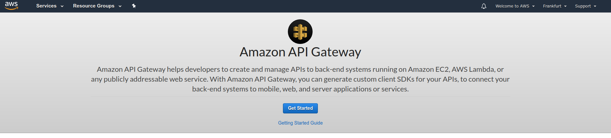

Click on `Get started` button. We want a `new REST API`.

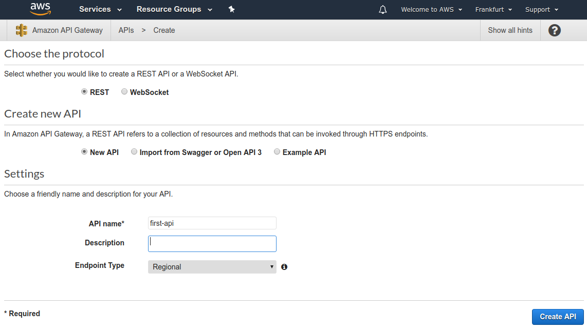

Not click on `Create API` and you will have this API.

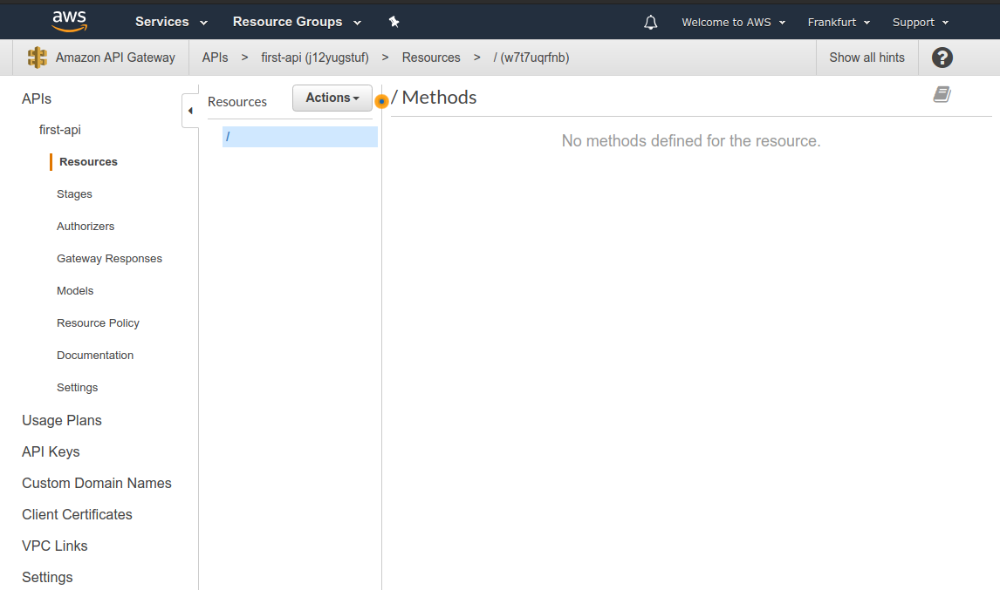

We can click on `Actions -> Create Resource` to create a new resource

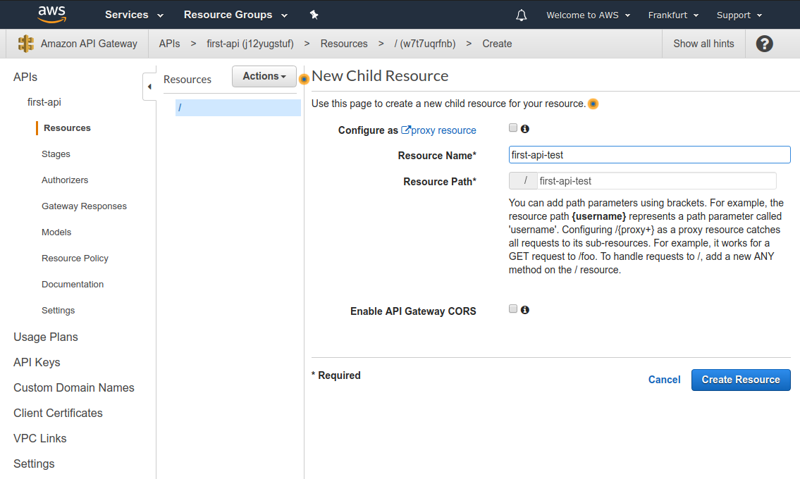

We can't call this yet, because we haven't provided request methods. We can do this by clicking on `Actions -> Create Method`.

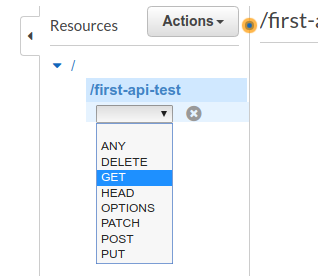

Now, we can provide an integration for the method like a:
- Lamda function
- HTTP endpoint
- Mock
- AWS service
- VPC link

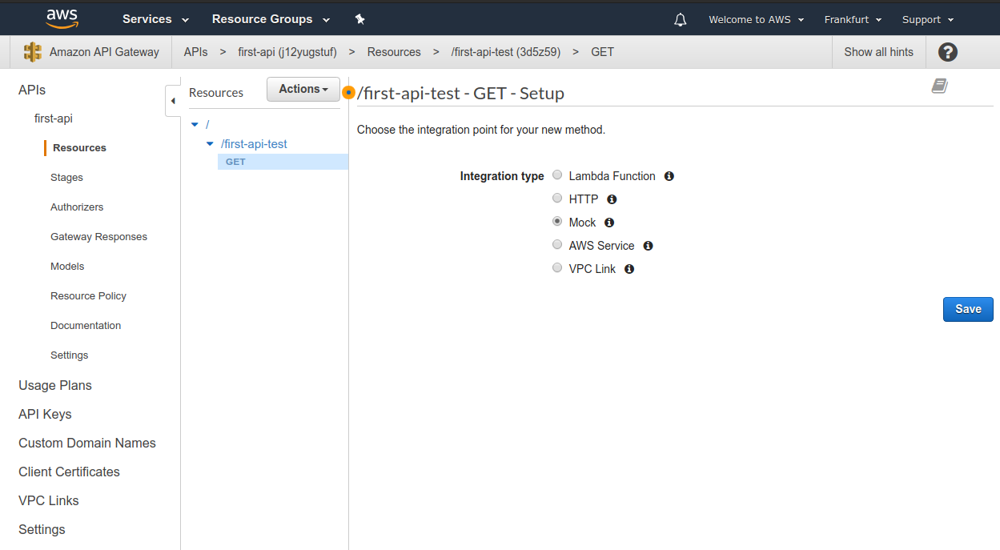

After choosing `Mock`, we can click on the `Integration Response`
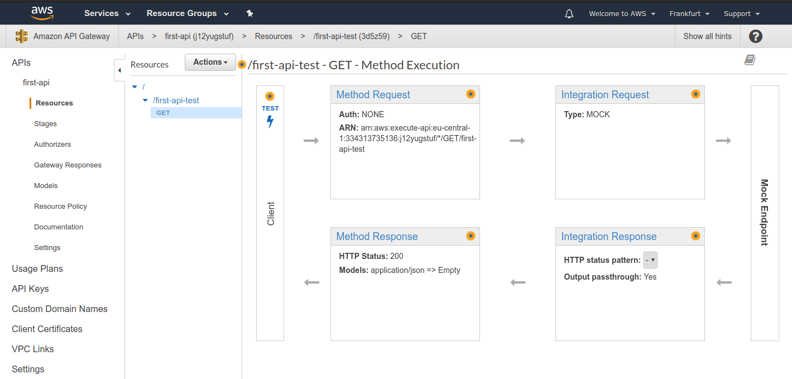

And set a `Mapping template`.

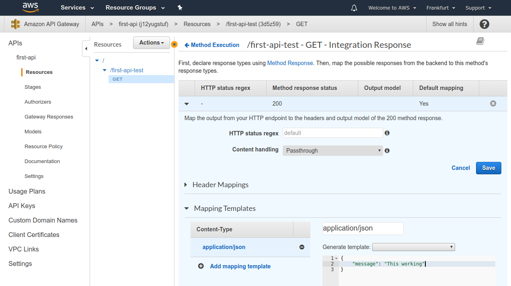

Now we are ready to deploy it by going to `Actions -> Deploy API`.
Select a new deployment stage.

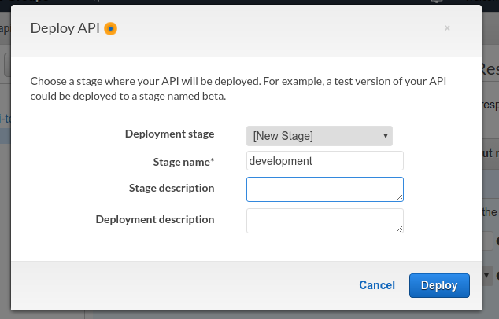

Then, we will receive an URL like `https://j12yugstuf.execute-api.eu-central-1.amazonaws.com/development`.

When visiting it, we will receive an error message:

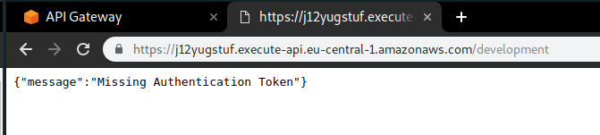

But, if we go to the actual endpoint at `https://j12yugstuf.execute-api.eu-central-1.amazonaws.com/development/first-api-test`, we are going to see the mock data.

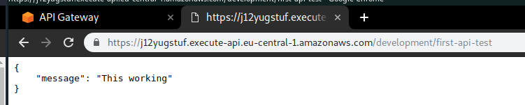