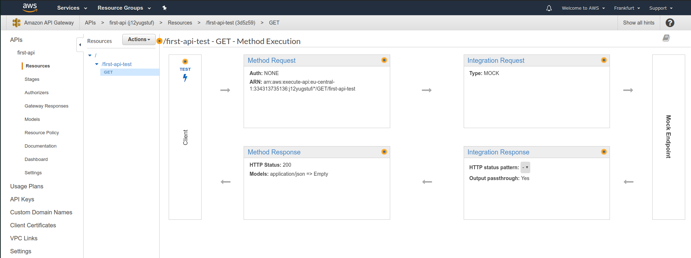
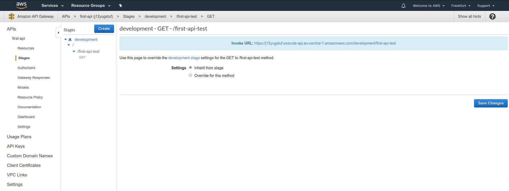
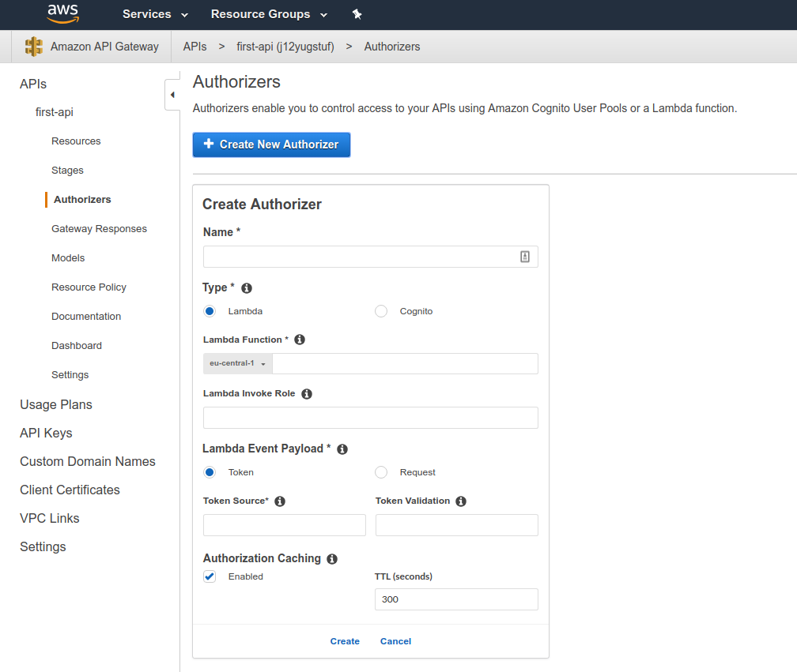
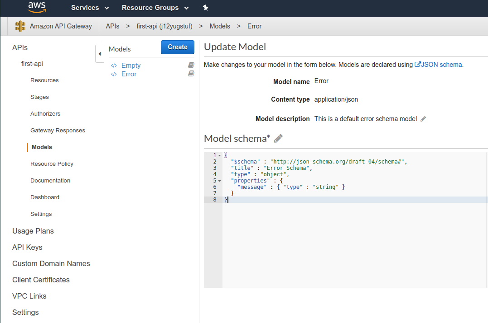
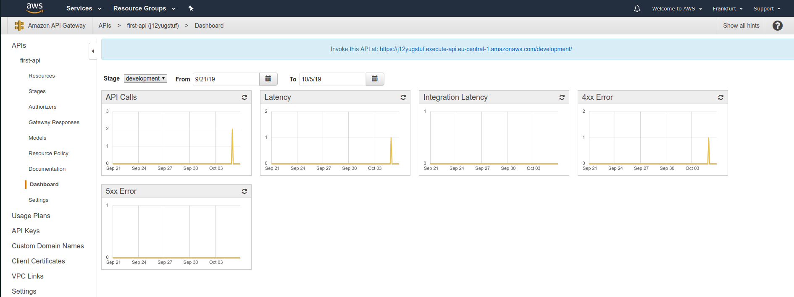
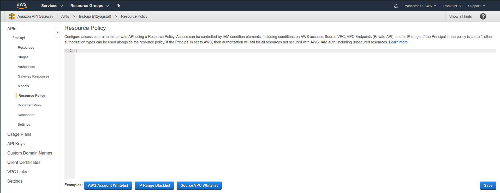

# API-specific features and options

Previously we created a resource and it's method.

The resource defines a path in the url. 

One thing to note is that when we are working on these things, they aren't live. We need to deploy them under the actions. Only then we will able to see them on the web.

The actual work happends under resources section.

Then under stages section we can we can get information about the deployment.

Under the `Authorizers` section we can add authentication to our APi. For certain resources that needs certain authentication, we can manage it here.

The `Models` section, we can define the shape of the data we are working on. It is provided in JSON format.

In the `Documentation` section we can create documentation for the API so people can know on how to use it.

The `Binary support` section is used when we are sending files in the requests.

The `Dashboard` shows shows stats about the API.

The `Resource Policy` section is used to control how the API is accessed. We can whitelist and/or blacklist resources.

