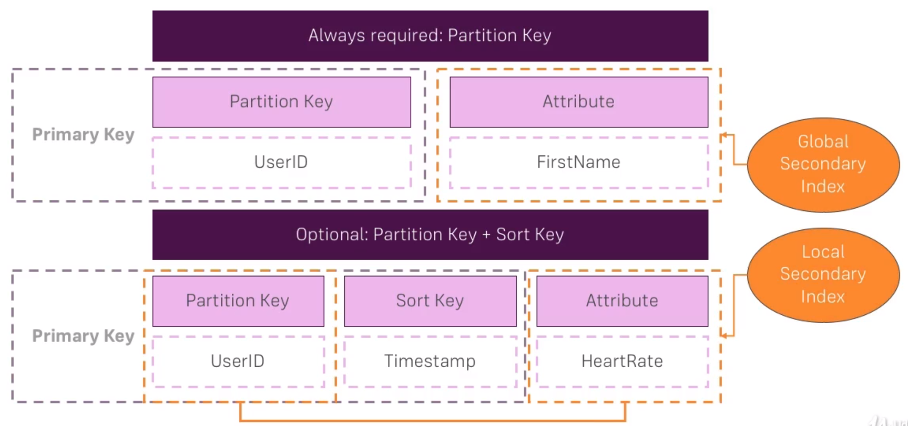

# How DynamoDB organizes data

In our DynamoDB table, we are always required to provide a partition key on each item, which has to be unique. This key is related to a way dynamodb stores data in paritions.

You can then set up a primary key which can be used for querying data.

As well as up to 5 indices for a table.

## Adding multiple databases

