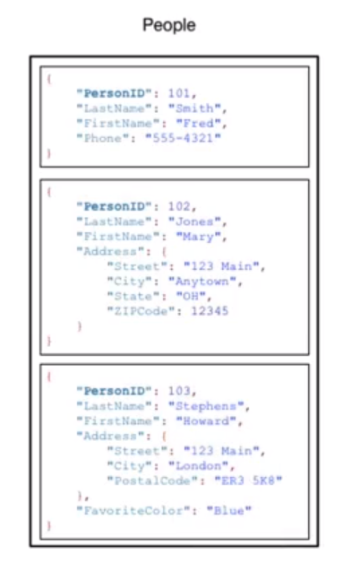

# What is DynamoDB

DynamoDB is a fully managed noSQL database provided by AWS. There are no relations in the database.

The data format for this is key-value pairs, without a schema.

Overview of the service is available at [https://aws.amazon.com/dynamodb/](https://aws.amazon.com/dynamodb/).

As well as the documentation at [https://docs.aws.amazon.com/amazondynamodb/latest/developerguide/Introduction.html](https://docs.aws.amazon.com/amazondynamodb/latest/developerguide/Introduction.html).