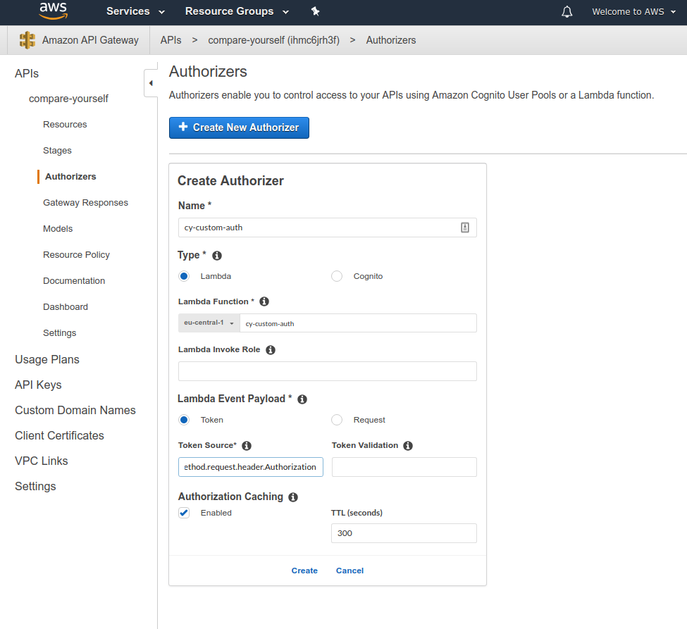
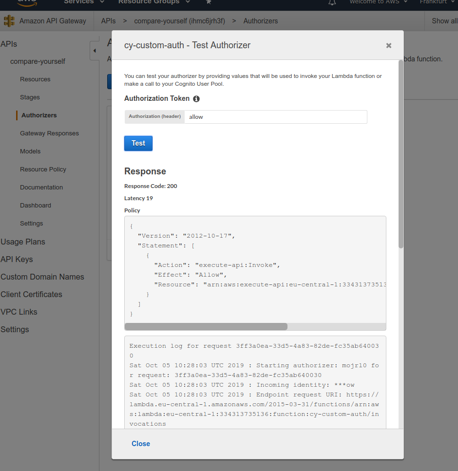

# How to add authorization to API Gateway

We can add an authorizer in the `Authorizers` section, this will call a custom lambda or cognito function.

For this we are going to create a new lambda function `cy-custom-auth`.

```js
exports.handler = (event, context, callback) => {
    
    const token = event.authorizationToken;
    
    if (token === 'allow') {
        
        callback(null, {
            principalId: 'afwfwa332afwe',
            policyDocument: genPolicy('Allow', event.methodArn),
            context: {
              simpleAuth: true  
            }
        })
        
    } else if (token == 'deny') {
        
        callback(null, {
            principalId: 'afwfwa332afwe',
            policyDocument: genPolicy('Deny', event.methodArn),
            context: {
              simpleAuth: true  
            }
        })
        
    } else {
        callback('Unauthorized');
    }
    
};

function genPolicy(effect, resource) {
    return {
        Version: '2012-10-17',
        Statement: [{
            Action: 'execute-api:Invoke',
            Effect: effect,
            Resource: resource,
        }]
    }
}
```

Now we can create an ew Authorizer.



Now we can click on test and enter `allow` or `deny` since that's what we're looking for in the code.


