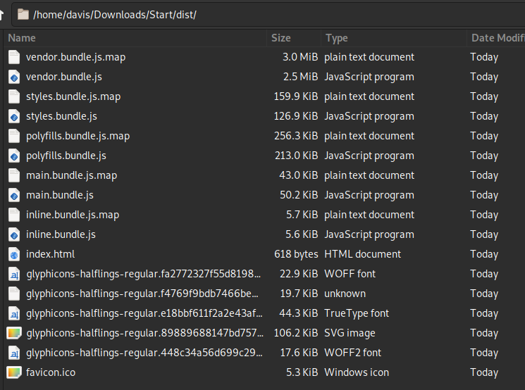
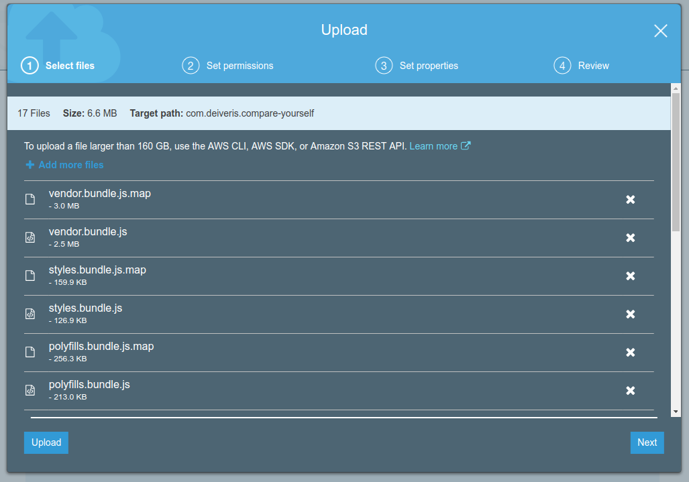
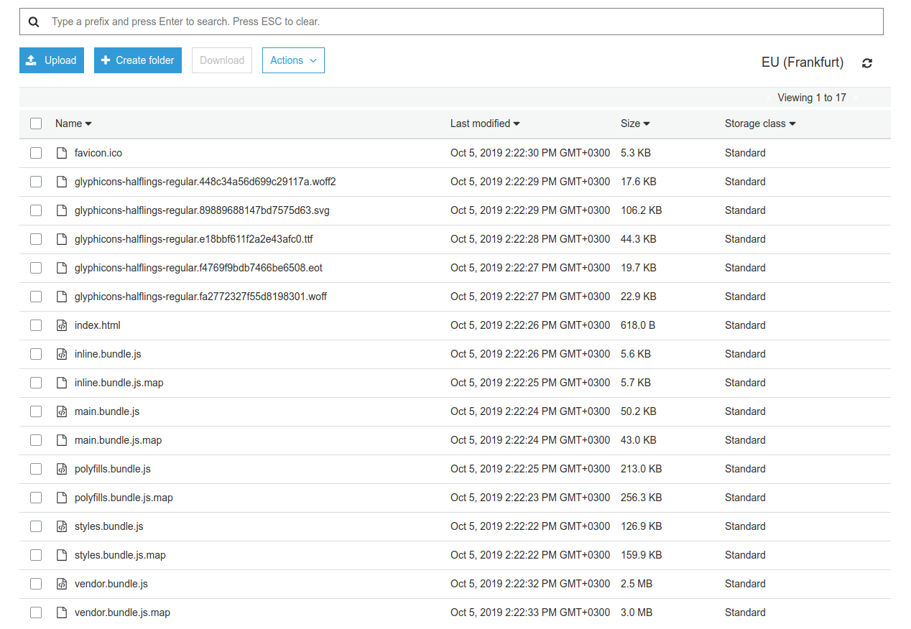

# Uploading the web app to S3

First we are going to build the project 

```
cd project
npm i
npm run build
```

When done you should have a dist folder with production built app.



Now, in S3 we can click on upload, select all the files and drag them over.



