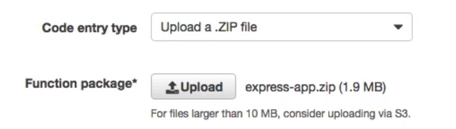
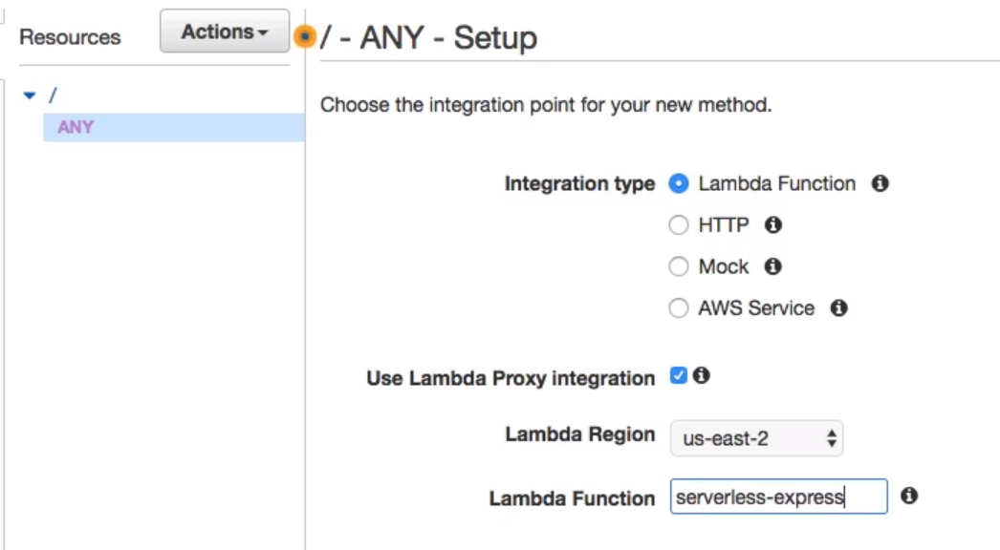

# non-API (MPA) serverless app

In this course we had a single page app with a separate API. We can also run an express app on lambda and get back HTML pages.

AWS Blog: Migrating your Express App to Lambda: https://aws.amazon.com/blogs/compute/going-serverless-migrating-an-express-application-to-amazon-api-gateway-and-aws-lambda/
Express Wrapper (Github): https://github.com/awslabs/aws-serverless-express

---

Create a new lambda function and instead of using inline code, we can specify to upload a zip file.

Then in `API Gateway`, create a new API, create a new metod with `ANY` and select `Use Lambda integration`. 

## Things to consider

- The application is still stateless, your sessions and files should still be stored elsewhere.
- For apps that may not see traffic for several minutes, you could see cold starts