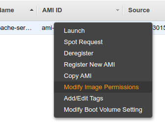
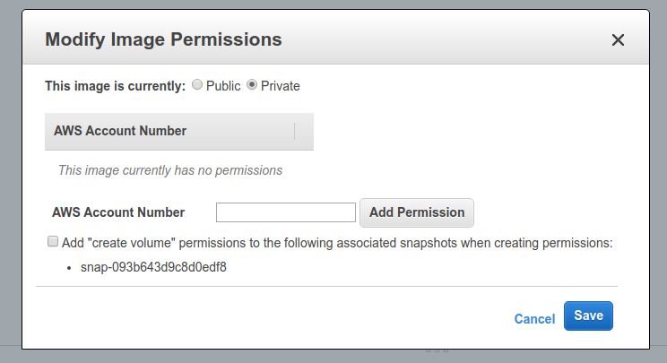

## Cross Account AMI Copy

https://docs.aws.amazon.com/AWSEC2/latest/UserGuide/CopyingAMIs.html

- You can share an [[EC2 AMIs]] with another [[AWS Account]]
- Sharing an [[EC2 AMIs]] does not affect the ownership of the AMI
- If you copy an AMI that has been shared with your account, you are the owner of the target AMI in your account.
- You copy an AMI that was shared with you from another account, the owner of the source AMI must grant you read permissions for the storage that backs the AMI, either associated [[EBS Snapshot]] (for an [[Amazon EBS-backed AMI]]) or an associated [[AWS S3 Bucket]] (for an [[instance store-backed AMI]]).
- Limits:
    - You can't copy an [[encrypted AMI]] that was shared with you from another account. Instead, if the underlying snapshot and encryption key were shared with you, you can copy the snapshot while re-encrypting it with a key of your own. You own the copied snapshot and can register it as a new AMI.
    - You can't copy an AMI with an associated billingProduct code that was shared with you from another account. This includes Windows AMIs and AMIs from the AWS marketplace. To copy a shared AMI with a billingProduct code, launch an EC2 instance in your account using the shared AMI and then create an AMI from the instance.

In order to share an AMI, you right click on it and select `Modify Image Permissions`.

