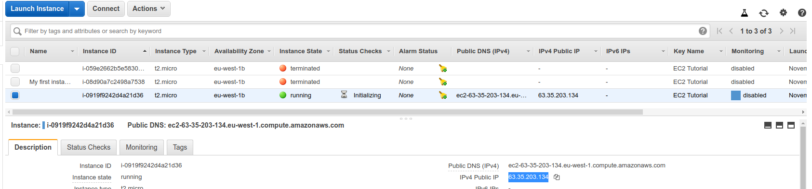
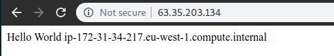
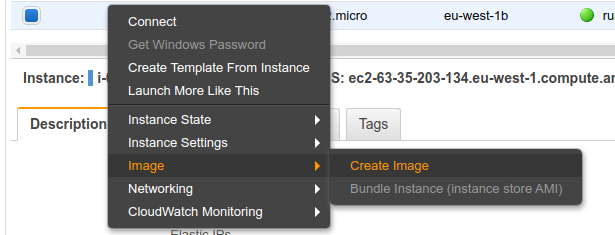
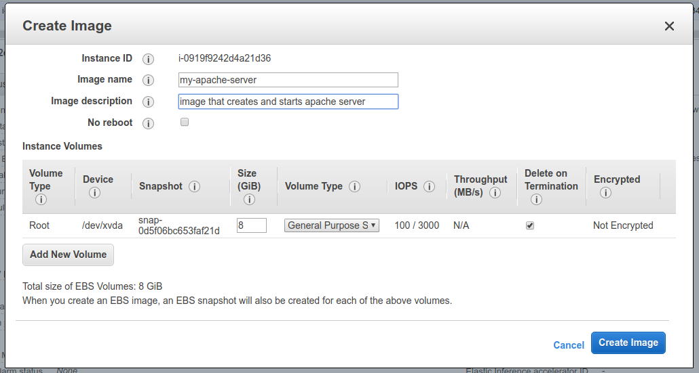
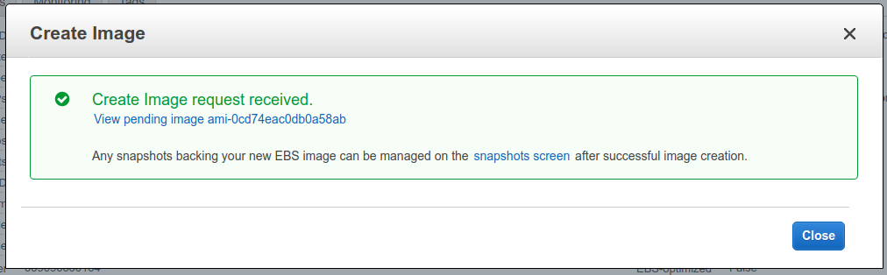
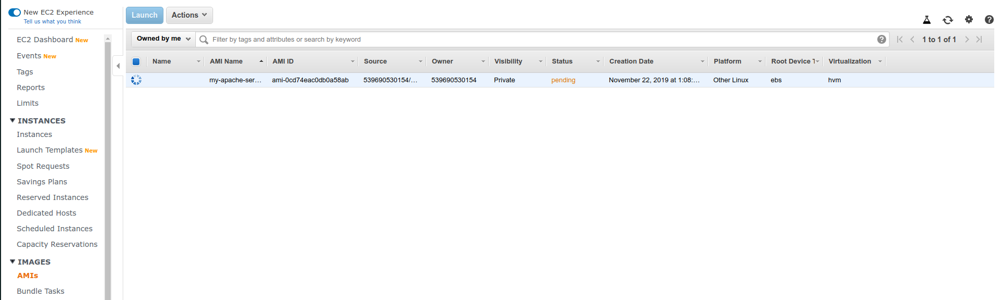
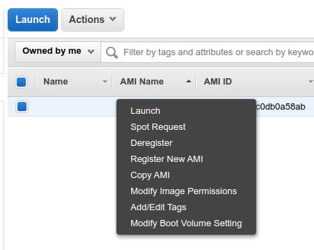
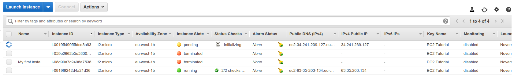
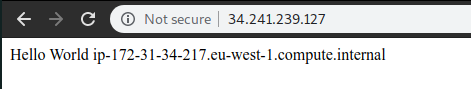

## Hands on

We are going to use a fresh EC2 instance and ssh into it.



```bash
➜  notes git:(master) ✗ ssh -i ~/Downloads/EC2Tutorial.pem ec2-user@63.35.203.134
The authenticity of host '63.35.203.134 (63.35.203.134)' can't be established.
ECDSA key fingerprint is SHA256:IRLAu1mhR88VLPx7js5V1kxaFHlg6TtNNVDSWpZKz5c.
Are you sure you want to continue connecting (yes/no/[fingerprint])? yes
Warning: Permanently added '63.35.203.134' (ECDSA) to the list of known hosts.

       __|  __|_  )
       _|  (     /   Amazon Linux 2 AMI
      ___|\___|___|

https://aws.amazon.com/amazon-linux-2/
5 package(s) needed for security, out of 13 available
Run "sudo yum update" to apply all updates.
[ec2-user@ip-172-31-34-217 ~]$ 
[ec2-user@ip-172-31-34-217 ~]$ sudo su
[root@ip-172-31-34-217 ec2-user]# yum update -y
[root@ip-172-31-34-217 ec2-user]# yum install -y httpd
[root@ip-172-31-34-217 ec2-user]# systemctl enable httpd
Created symlink from /etc/systemd/system/multi-user.target.wants/httpd.service to /usr/lib/systemd/system/httpd.service.
[root@ip-172-31-34-217 ec2-user]# systemctl start httpd
[root@ip-172-31-34-217 ec2-user]# echo "Hello World $(hostname -f)" > /var/www/html/index.html
[root@ip-172-31-34-217 ec2-user]# curl localhost:80
Hello World ip-172-31-34-217.eu-west-1.compute.internal
```

Visit the public IP from a browser:



Now we can create an image from the instance by doing the following:







Now we can go to AMIs section and see the image.



When it's complete, we can do multiple things with it:




We'll click on launch and it will take us through a new instance creation process.



Once it's online, we can visit it in browser:


