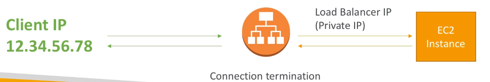

## Application Load Balancer (v2)

- Application [[Load Balancer]]s ([[Layer 7]]) allow to do:
    - Load balancing to multiple [[HTTP]] applications across machines ([[target group]]s)
    - Load balancing to multiple applications on the same machine (ex: [[container]]s)
    - Load balancing based on route in URL
    - Load Balancing based on [[hostname]] in URL
- Basically, they're awesome for micro services & container-based applications (example: [[Docker]] & [[Amazon ECS]])
- Has a port mapping feature to redirect to a dynamic port
- In comparison, we would need to create one Classic Load Balancer per application before. That was very expensive and inefficient.

- Stickiness can be enabled at the target group level
    - Same request goes to the same instance
    - [[Stickiness]] is directly generated by the ALB (not the application)
- ALB support [[HTTP]]/[[HTTPS]] & [[Websockets]] protocols
- The application servers don't see the IP of the client directly
    - The true [[IP]] of the client is inserted in the [[header]] [[X-Forwarded-For]].
    - We can also get [[Port]] ([[X-Forwarded-Port]]) and [[proto]] ([[X-Forwarded-Proto]])

