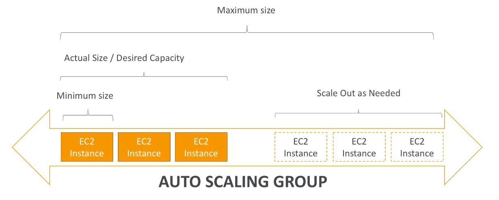
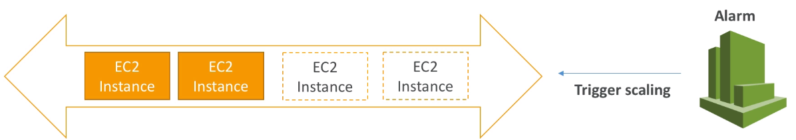
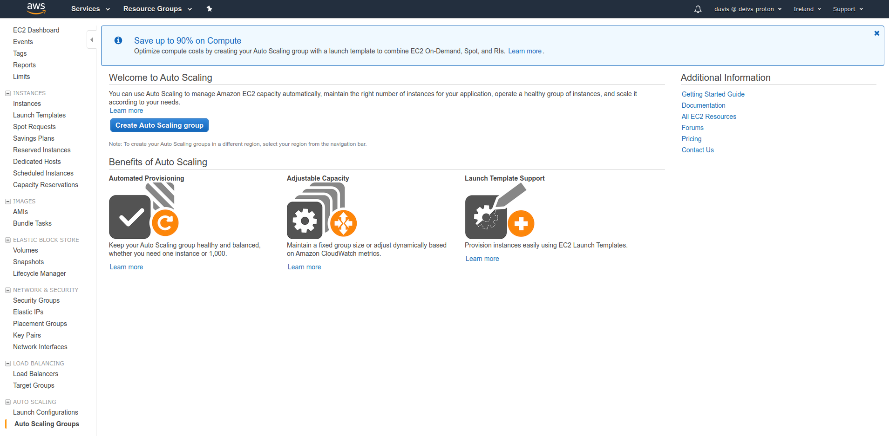
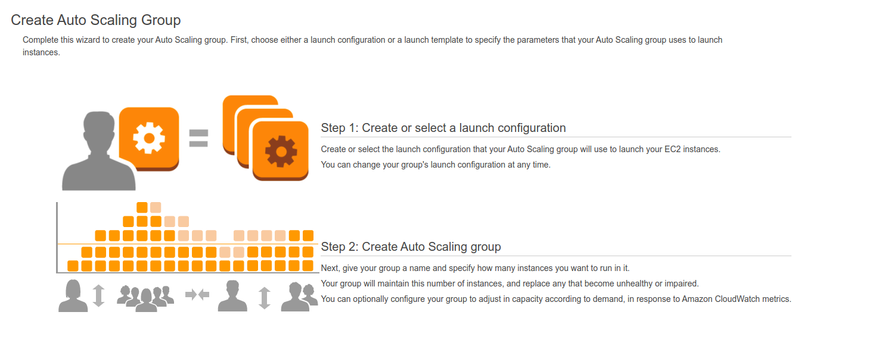
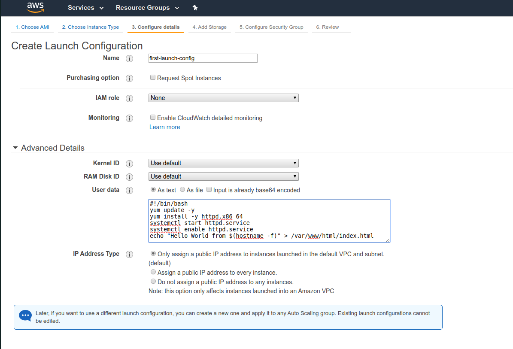
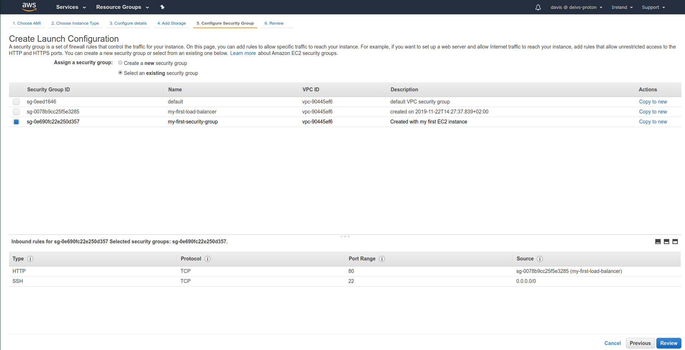
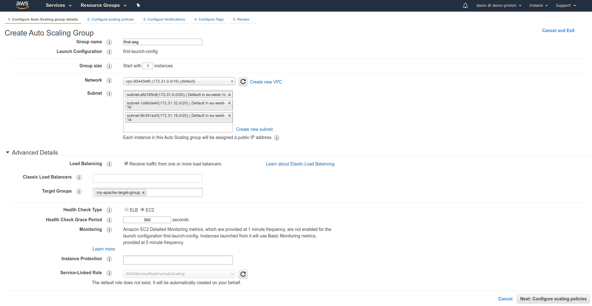
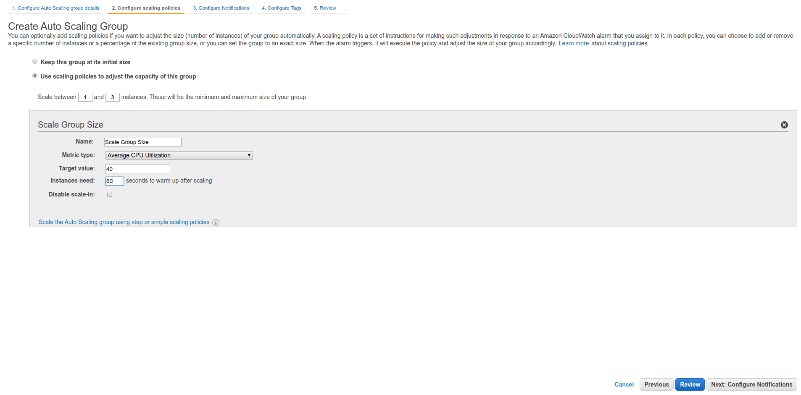
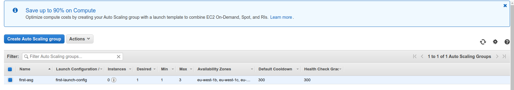
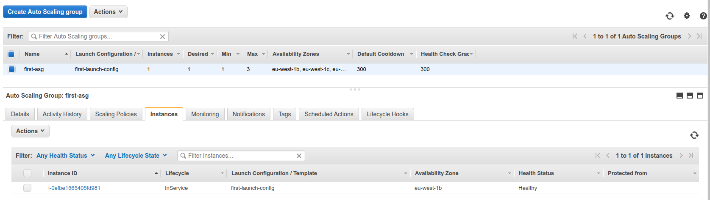

# Auto Scaling Groups

- In real-life, the load on your websites and application can change
- In the cloud, you can create and get rid of servers very quickly

- The goal of an Auto Scaling Group (ASG) is to:
    - Scale out (add EC2 instances) to match an increased load
    - Scale in (remove EC2 instances) to match a decreased load
    - Ensure we have a minimum and maximum number of machines running
    - Automaticall Register new instances to a load balancer

ASGs have the following attributes
- A launch configuration
    - AMI + Instance Type
    - EC2 User Data
    - EBS Volumes
    - Security Groups
    - SSH Key Pair
- Min Size / Max Size / Initial Capacity
- Network + Subnets Information
- Load Balancer Information
- Scaling Policies

## Auto Scaling Alarms

- It is possible to scale an ASG based on CloudWatch alarms
- An alarm monitors a metric (such as Average CPU)
- Metrics are computed for the overall ASG instances
- Based on the alarm:
    - We can create scale-out policies (increase the number of instances)
    - We can create scale-in policies (decrease the number of instances)

- It is now possible to define "better" auto scaling rules that are directly managed by EC2
    - Target average CPU usage
    - Number of requests on the ELB per instance
    - Average Network In
    - Average Network Out
- These rules are easier to set up and can make more sense

- We can also create custom metrics (ex: number of connected users)
- This can be done by sending a custom metric from application via PutMetric API, then creating a CloudWatch alarm reacting to low / high values.

----

- Scaling policies can be on CPU, Network... and can even be on custom metrics or based on a schedule.
- ASGs use Launch configurations and you update an ASG by providing a new launch configuration
- IAM roles attached to an ASG will get assigned to EC2 instances
- ASG are free. You pay for the underlying resources being launched
- Having instances under an ASG means that if they get terminated for whatever reason, the ASG will restart them. Extra safety!
- ASG can terminate instances marked as unhealthy by an LB (and hence replace them)

## Hands On

We can go to the `Auto Scaling Group` section in `EC2` to set up this up.

When clicking on the `Create Auto Scaling Group` we are given the steps - we'll need to create and auto scaling template and the and then the group itself.

Then we basically follow the steps as it would be for any EC2 instance.

After finishing this, we are redirected to `Auto Scaling Group Creation`. 

After the initialization, we can see that it has added 1 instance to it.

## Auto Scaling Groups For Solutions Architects

- ASG Default Termination Policy (simplified version)
    - Find the AZ which has the most number of instances
    - If there are multiple isntances in the AZ to choose from, delete the one with the oldest configuration
- ASG tries the balance the number of instances across AZ by default

- The cooldown period helps to ensure that your Auto Scaling group doesn't launch or terminate additional instances before the previous scaling activity takes effect.
- In addition to default cooldown for Auto Scaling group, we can create cooldowns that apply to a specific simple scaling policy
- A scaling-specific cooldown period overrides the default cooldown period
- One common use for scaling-specific cooldowns is with a scale-in policy - a policy that terminates instances based on a specific criteria or metric. Because this policy terminates instances, Amazon EC2 Auto Scaling needs less time to determine whether to termindate additional instances.
- If the default cooldown period of 300 seconds is too long - you can reduce costs by applying a scaling-specific cooldown period of 180 seconds to the scale-in policy.
- If your application is scaling up and down multiple times each hour, modify the auto scaling groups cool-down timers and the cloud watch alarm period that triggers the scale in

