# Load Balancing

Load balancers are servers that forward internet traffic to multiple servers (EC2 instances) downstream.

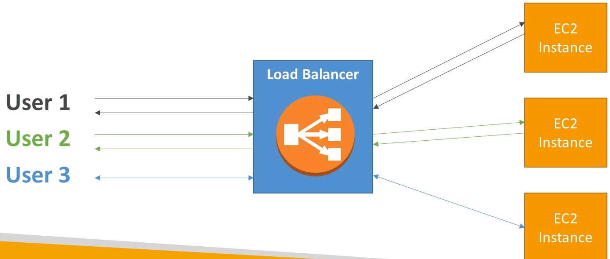

## Why use a [[load balancer]]?
- Spread load accross multiple downstream instances
- Expose a single point of access (DNS) to your application
- Seamlessly handle failures of downstream instances
- Do regular health checks to your instances
- Provide SSL termintaion (HTTPS) for your websites
- Enforce stickiness with cookies
- High availability accross zones
- Separate public traffic from private traffic

## Why use an EC2 Load Balancer?

- An ELB (EC2 Load Balancer) is a manged load balancer
    - AWS guarantees that it will be working
    - AWS takes care of upgrades, maintenance, high availability
    - AWS provides only a few configuration knobs
- It costs less to setup your own load balancer but it will be a lot more effort on your end.
- It is integrated with many AWS offerings / services

## Types of load balancers on AWS

- [[Classic Load Balancer]] (v1 - old generation) - 2009
- [[Application Load Balancer (v2)]] (v2 - new generation) - 2016
- [[Network Load Balancer (v2)]] (v2 - new generation) - 2017

Overall, it is recommended to use the newer / v2 generation load balancers as they provide more features.

You can setup internal (private) or external (public) ELBs.

![[Health Checks]]

![[Application Load Balancer (v2)]]

![[Network Load Balancer (v2)]]

## Good to know
- [[Classic Load Balancer]] are Deprecated
    - [[Application Load Balancer (v2)]] for [[HTTP]] / [[HTTPS]] & [[Websockets]]
    - [[Network Load Balancer (v2)]] for [[TCP]]
- CLB and ALB support [[SSL certificates]] and provide [[SSL termination]]
- All Load Balancers have [[Health Checks]] capability
- ALB can route based on hostname / path
- ALB is a great fit with [[ECS - Elastic Container Service]] ([[docker]])
- Any Load Balancer (CLB, ALB, NLB) has a [[static host name]]. Do not resolve and use underlying IP.
- LBs can scale but not instantaneously - contact AWS for a "warm-up"
- NLB directly see the client IP
- 4xx errors are client induced errors
- 5xx errors are application induced errors
    - Load Balancer Errors 503 means at capacity or no registed target
- If the LB can't connect to your application, check your security groups.

[[HTTP STATUS CODES]]

## Hands On

We can create a Load Balancer in `Load Balancers` section. There we can choose between the 3 types of load balancers:

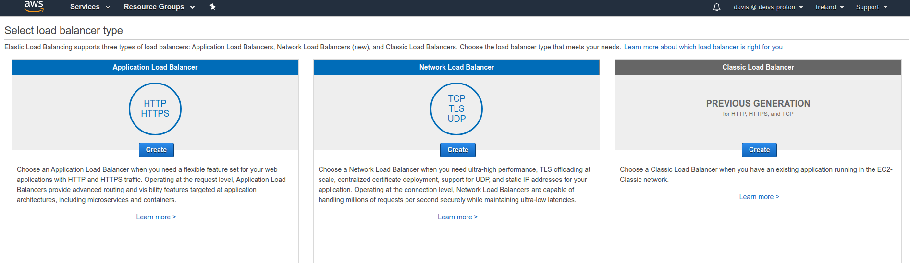

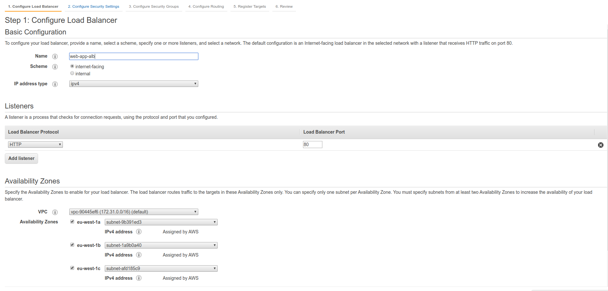

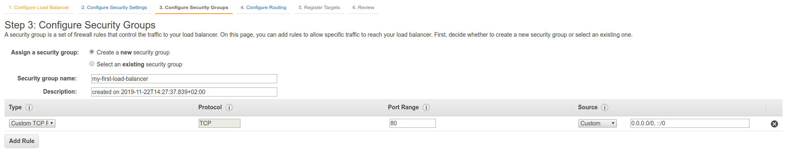

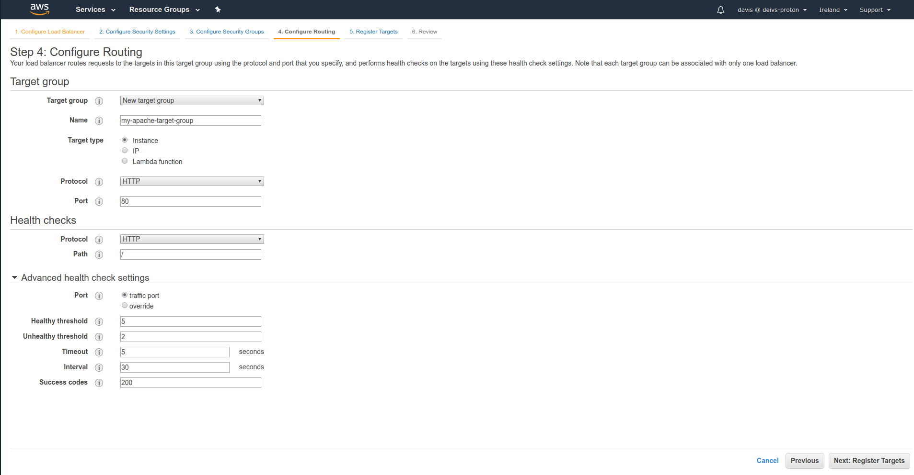

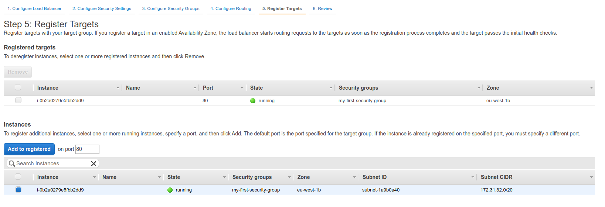

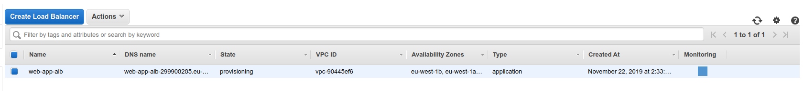

Once the Load Balancer has been provisioned, we can get it's DNS name.

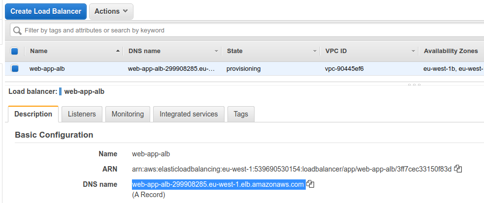

And when opening it via browser, it should be working:

In listeners section we can see that the port 80 is forwarded to the `my-apache-target-group`, if we want we can add more target groups.

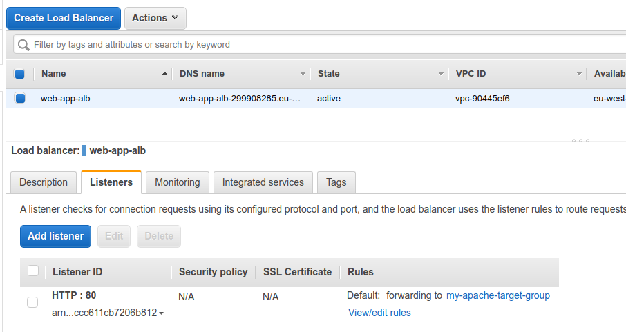

Or even add custom rules

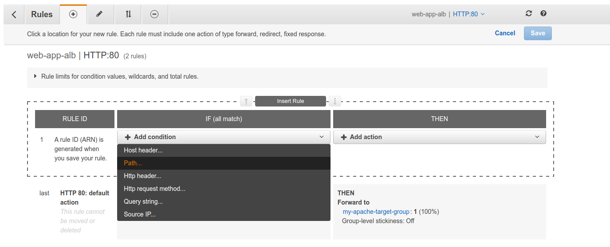

When visiting the target group, we can add more targets to the group.

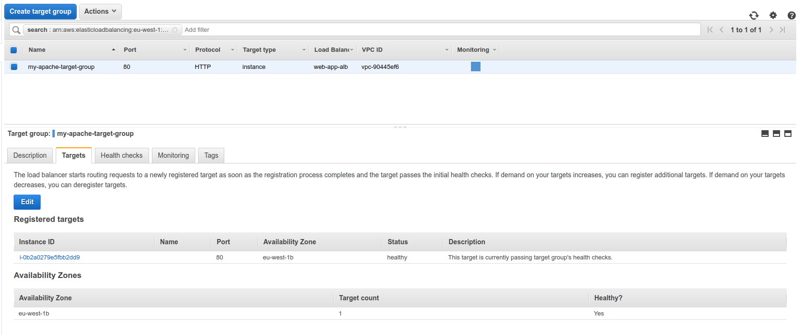

Lastly, we can go to the `Security Groups` and modify the `my-first-security-group` that the `web app` uses to accept traffic only from the load balancer.

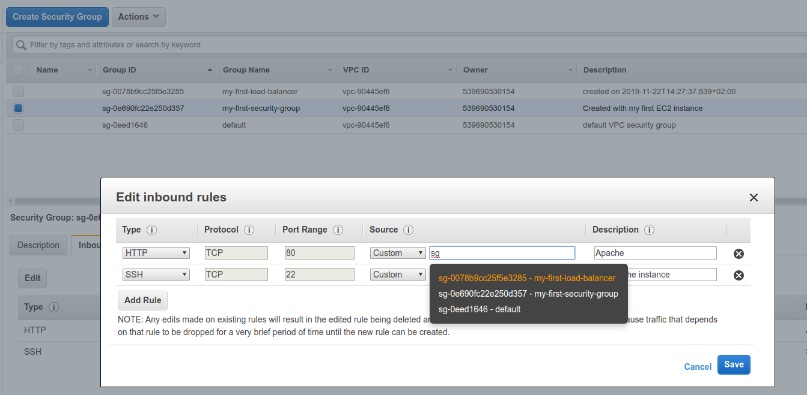

So now, when we visit the load balancer URL, everything should be working, but we visit the ec2 directly, it has a timeout.

## Adding instances to Load Balancer

Currently the Load Balancer isn't really doing any load balancing, since there is only one instance. We might want to add more intances.

Now, we'll create 3 instances with user data like in the previous sections.

Now we can go to the `Target Groups` and add these targets.

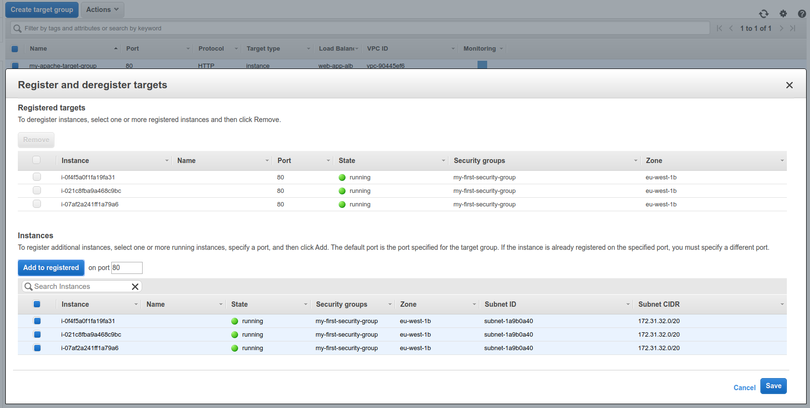

Now, when refreshing the load balancer url, we should see different hostnames.

## [[Stickiness]]

- It is possible to implement stickiness so that the same client is always redirected to the same instance behind a load balancer
- This works for Classic Load Balancers & Application Load Balancers
- The "[[cookie]]" used for stickiness has an expiration date you control
- Use case: make sure the user doesn't lose his session data
- Enabling stickiness may bring imbalance to the load over the backend EC2 instances

The stickiness can be enabled while modifying target groups.

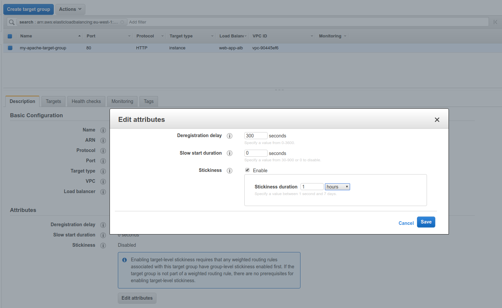

## Load Balancers for Solutions Architect

- Classic Load Balancers: questions on security groups, stickiness
- Application Load Balancer ([[Layer 7]] of [[OSI]])
    - Support routing based on [[hostname]]
    - Support routing based on path
    - Support redirects (e.g. [[HTTP]] to [[HTTPS]])
    - Support [[dynamic host port mapping]] with ECS
- NLB ([[Layer 4]] of [[OSI]]) gets a [[static IP]] per [[Availability Zone]]:
    - Public facing: must attach [[Elastic IP]] - can help whitelist by clients
    - Private facing: will get random [[Private IP]] based on free ones at the time of creation
    - Has [[cross zone balancing]]
    - Has [[SSL termination]] (Jan 2019)