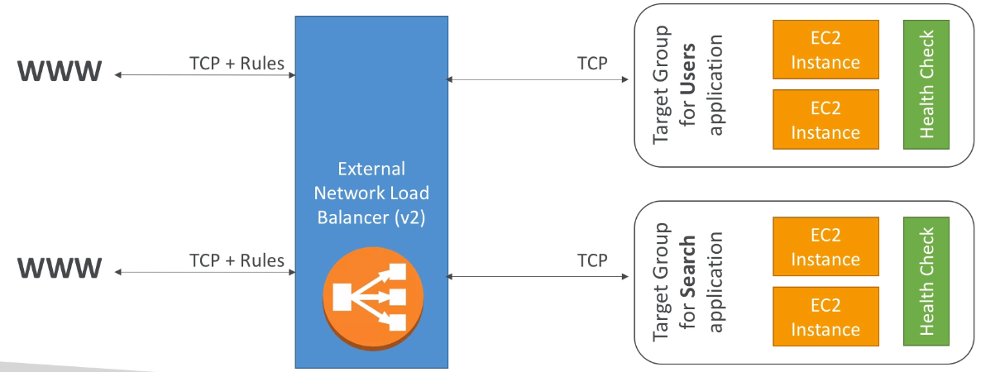

## Network Load Balancer (v2)

- Network [[Load Balancer]]s ([[layer 4]]) allow to do:
    - Forward [[TCP]] traffic to your instances
    - Handle millions of requests per seconds
    - Support for [[static IP]] or [[elastic IP]]
    - Less latency ~100ms (vs 400ms for [[Application Load Balancer (v2)]])
- Network Load Balancers are mostly used for extreme performance and should not be the the default load balancer you choose
- Overall, the creation process is the same as [[Application Load Balancer (v2)]]

