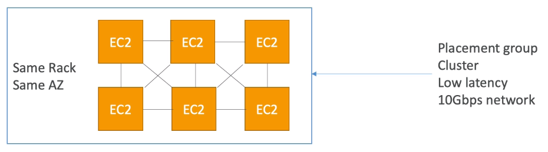

## EC2 Cluster Placement Strategy

Pros:
- Great network (10gbps bandwidth between instances)
Cons:
- If the rack fails, all instances fails at the same time
Use case:
- Big Data job that needs to complete fast
- Application that needs extremely low latency and high network throughput
