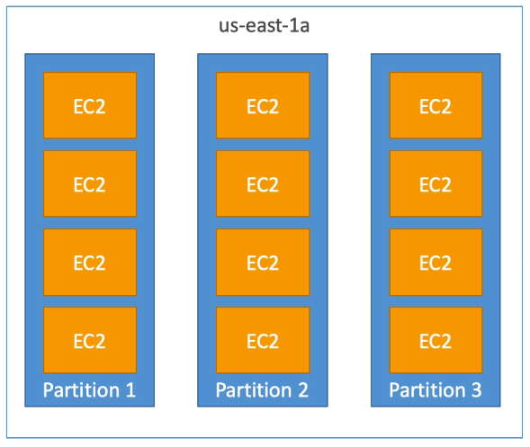

## Partition Placement Strategy

- Up to 7 partitions per [[Availability Zone]]
- Up to 100s of [[AWS EC2]] instances
- The instances in a partition do not share racks with the instances in other partitions

- A [[partition failure]] can affect many [[AWS EC2]] but won't affect other partitions
- [[AWS EC2]] instances get access to the partition information as metadata

Use cases:
- [[HDFS]]
- [[HBase]]
- [[Cassandra]]
- [[Kafka]]