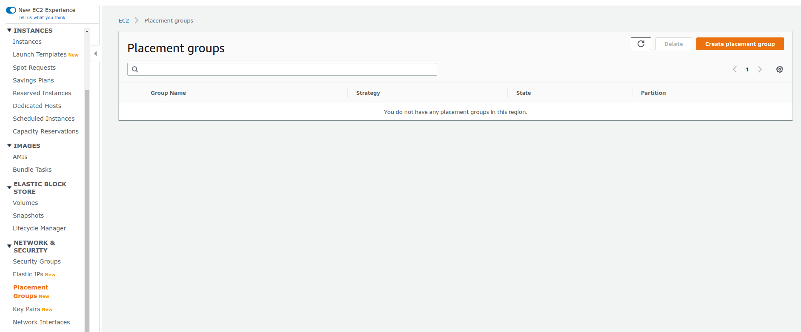
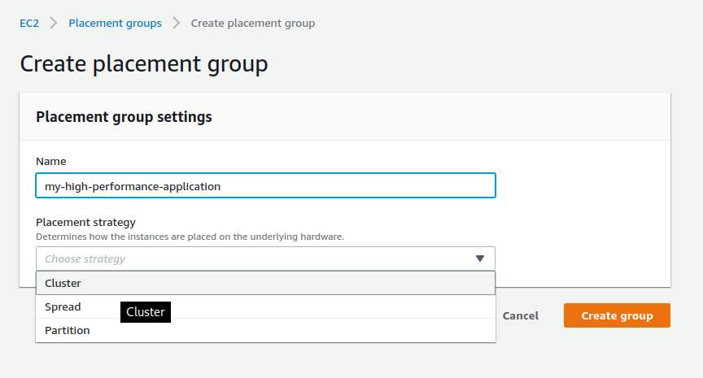
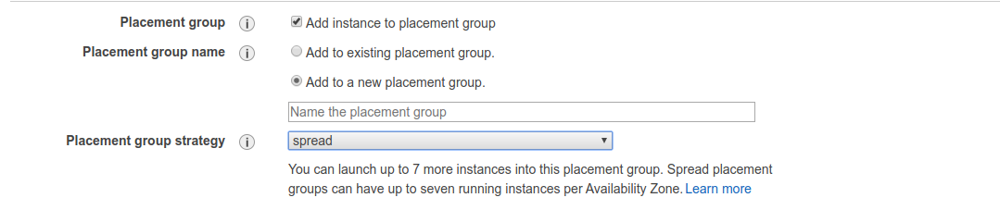

# EC2 Placement Groups

- Sometimes you want control over the EC2 Instance placement strategy
- That strategy can be defined using placement groups
- When you create a placement group, you specify one of the following strategies for the group
    - Cluster - clusters instances into a low-latency group in a single availability zone
    - Spread - spreads instances across underlying hardware (max 7 instances per group per AZ) - critical applications
    - Partition - spreads instances across many different partitions (which rely on sets of racks) within an AZ. Scales to 100s of EC2 instances per group (Hadoop, Cassandra, Kafka)

![[EC2 Cluster Placement Strategy]]

![[EC2 Spread Placement Strategy]]

![[EC2 Partition Placement Strategy]]

## Usage

You can find these options under `Network & Security -> Placement Groups`.

Now, when creating a new instance, we can specify a placement group.

