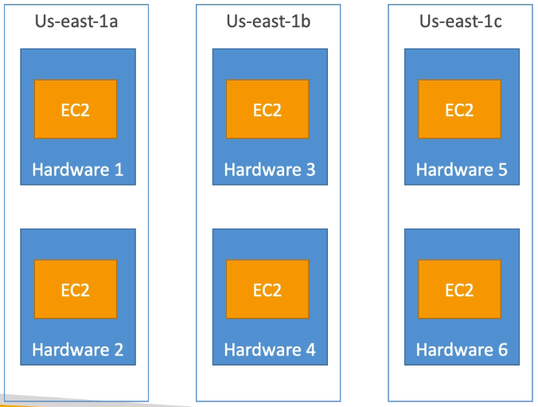

## Spread

Pros:
- Can span across Availability Zones (AZ)
- Reduced risk of simulataneous failure
- EC2 Instances are on different physical hardware

Cons:
- Limited to 7 instances per AZ per placement group

Use case:
- Application that needs to maximize high availability
- Critical Applications where each instance must be isolated from failure from each other
