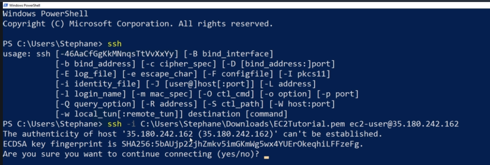
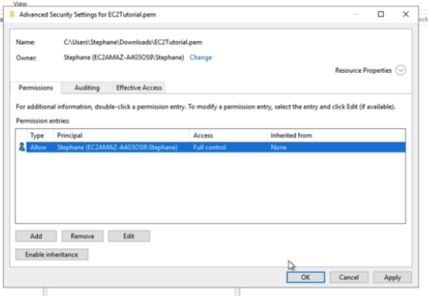

## [[SSH]] using [[Windows]] 10

You can use [[PowerShell]] or [[cmd]]. Type in `ssh` and it should be available. If it's not, you will need to use the [[PuTTY]] route.

If it throws an error regarding [[keypair permissions]], open up the properties of the file, go to the `Security tab -> Advanced`, change the owner to yourself, remove any other users. If you cannot do that, disable the Inheritance.

