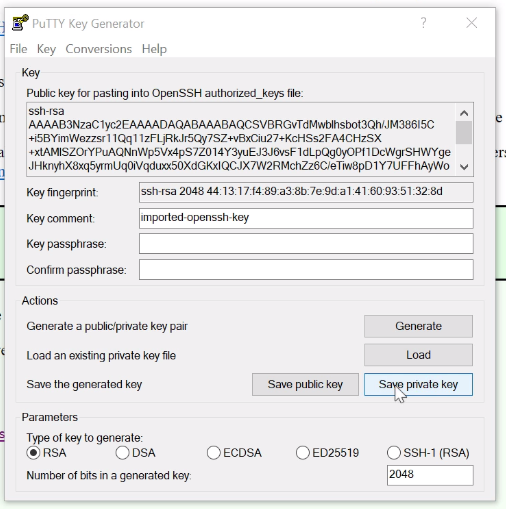
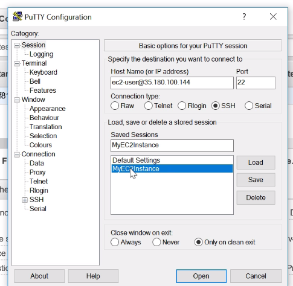
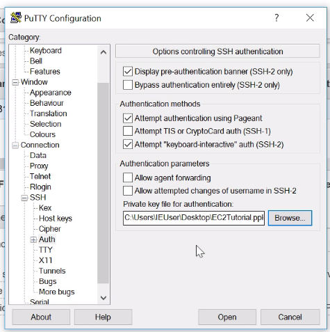

## SSH Using Windows

Download [Putty](https://www.chiark.greenend.org.uk/~sgtatham/putty/latest.html) and install it.

We can open up `Putty Key Generator` to convert the keypair we downloaded previously from `.pem` to `.ppk`.

Click on `Load private key`, open up the keypair. Load it and click on `Save private key`.

Then we can open up `PuTTY` and enter the username and IP address of our EC2 machine, save it.

Then go to `Connection -> SSH -> Auth`, where we can specify the private key.

