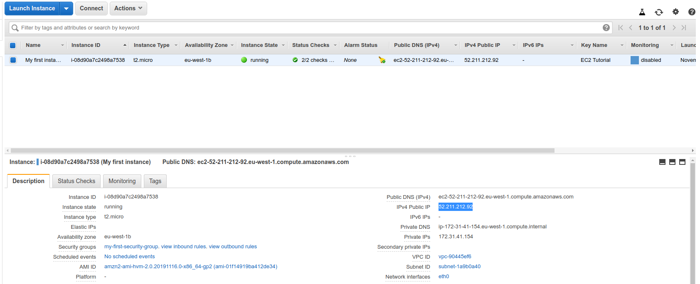

## SSH from Linux or Mac

Get the Public IP of the intance you want to connect to:



Open up a terminal on your OS. Move your key pair file you downloaded when creating the instance.

```bash
➜  notes git:(master) ✗ sudo chmod 0400 ~/Downloads/EC2Tutorial.pem
[sudo] password for davis: 
er@52.211.212.92
The authenticity of host '52.211.212.92 (52.211.212.92)' can't be established.
ECDSA key fingerprint is SHA256:8os5YxNJ1iInCADO07oMntsT/8g+kSsK4z2R1xQvzZU.
Are you sure you want to continue connecting (yes/no/[fingerprint])? yes
Warning: Permanently added '52.211.212.92' (ECDSA) to the list of known hosts.

       __|  __|_  )
       _|  (     /   Amazon Linux 2 AMI
      ___|\___|___|

https://aws.amazon.com/amazon-linux-2/
5 package(s) needed for security, out of 13 available
Run "sudo yum update" to apply all updates.
[ec2-user@ip-172-31-41-154 ~]$ pwd
/home/ec2-user
[ec2-user@ip-172-31-41-154 ~]$ 
```
