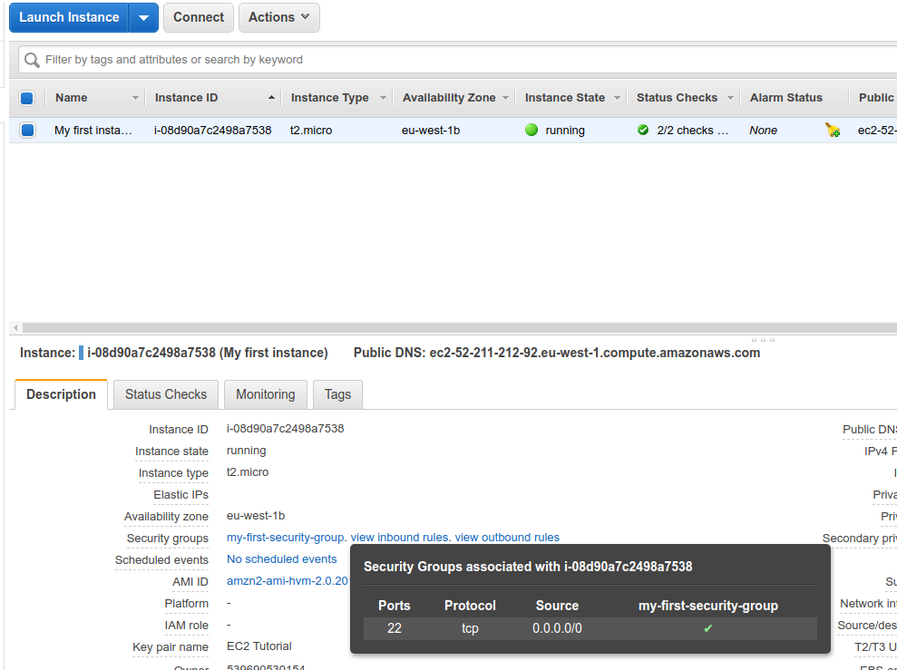
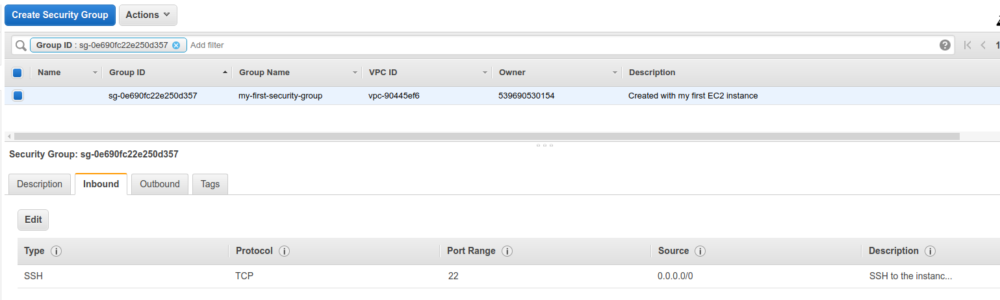
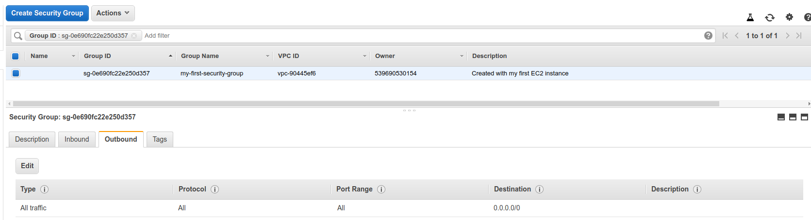

# Introduction to Security Groups

- Security Groups are the fundamental of [[network security]] in AWS
- They control how traffic is allowed into or out of our [[AWS EC2]] machines.

- It is the most fundamental skill to learn to [[troubleshoot networking issues]]

We can view our instance security groups and rules by clicking on them and viewing `Security Groups`.

By clicking on a security group, we can see and edit the inbound, outbound rules of those security groups as well as tags for them.

[[Security Groups Deep Dive]]