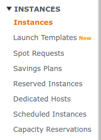
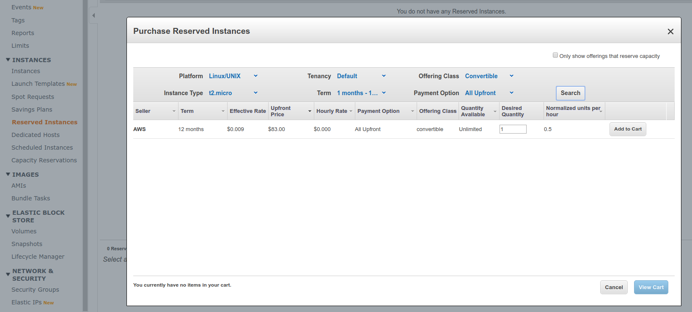
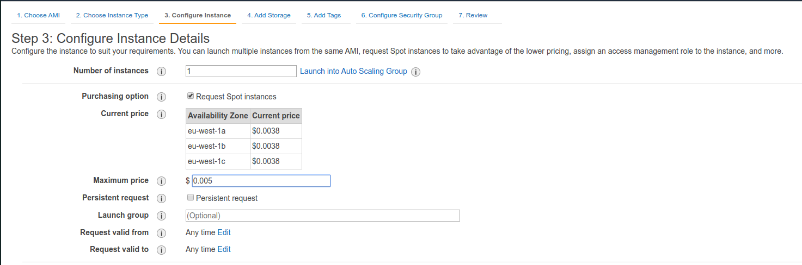
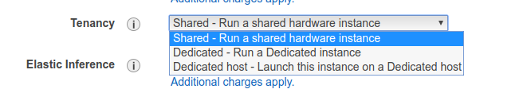

## Hands on

When viewing [[AWS EC2]] instances on the left sidebar, we have a list of these types available.

Then, we can search for a reserved instance with a term of 12 months and payment upfront.

Similar process goes for all the other types.

For spot instances, we can click on launch an instance and in the configuration, set settings for it.

Same goes with dedicated hardware, we can select that in the same form.

