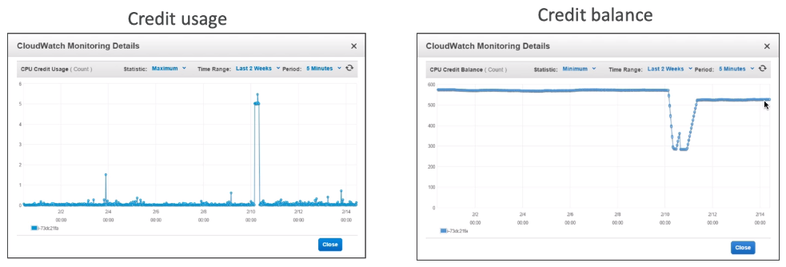
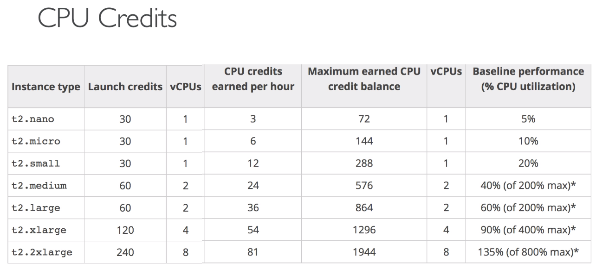

# EC2 Instance Launch Types

![[EC2 On Demand Instances]]

![[EC2 Reserved Instances]]

![[EC2 Spot Instances]]

![[ EC2 Dedicated Instances ]]

![[EC2 Dedicated Hosts]]

[[EC2 Instance Launch Types Hands On]]

## Deep Dive

- R - applications that need a lot of RAM - in-memory caches
- C - applications that needs good CPU - compute / databases
- M - applications that are balanced - general / web app
- I - applications that needs good local I/O - storage
- G - applications that need a GPU - video rendering / machine learning
- T2 / T3 - burstable instaces 
    - AWS has the concept of burstable instances
    - Burst means that overall, the instance has OK CPU performance
    - When the machine needs to process something unexpected (a spike in load for example), it can burst, and CPU can be VERY good.
    - If the machine bursts, it utilizes "burst credits"
    - If all the credits are gone, the CPU becomes bad
    - If the machine stops bursting, credits are accumulated over time
    - Amazin to handle unexpected traffic and getting the instance that it will handle it correctly
    - If your instance consistently runs low on credit, you need to move to a different kind of non-burstable instance
    
- T2 / T3 - unlimited
    - It is possible to have an unlimited burst credit balance
    - You pay extra money if you go over your credit balance, but you don't lose performance
    - Overall, it is a new offering, so be careful, costs could go high if you're not monitoring the health of your instances

We can see all the instance types available at [https://ec2instances.info/](https://ec2instances.info/).

