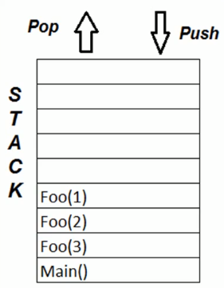

# How Recursion works internally

Given an example

```
foo(n) {
    if (n < 1)
        return
    else foo(n-1)
    print "Hello World" + n
}

main() {
    foo(3)
}
```

The function calls will be stored in a stack memory like so:



