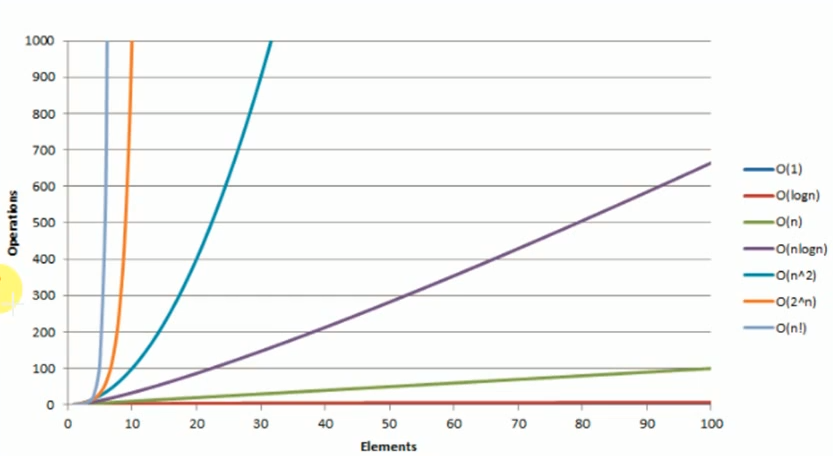

# Examples of runtime complexities

| Time complexity | Name               | Example                                     |
|-----------------|--------------------|---------------------------------------------|
| O(1)            | Constant           | Adding an element in front of a linked list |
| O(log n)        | Logarithmic        | Finding an element in sorted array          |
| O(n)            | Linear             | Finding an element in unsorted array        |
| O(n log n)      | Linear logarithmic | Merge Sort                                  |
| O(n^2)          | Quadratic          | Shortest path between 2 nodes in a graph    |
| O(n^3)          | Cubic              | Matrix multiplication                       |
| O(2^n)          | Exponential        | Tower of Hanoi Problem                      |

