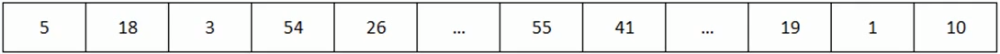
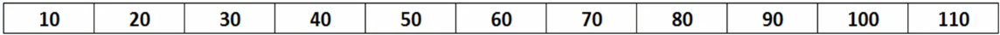

# Findint time complexity of a recursive algorithm

## Example 1



```
findBiggestNumber(A, n):
    static highest = Integer.Min
    if n == -1
        return highest
    else
        if A[n] > highest
            update highest
    return FindBiggestNumber(A, n - 1)
```

```
findBiggestNumber(A, n): ------------------------ T(n)
    static highest = Integer.Min ---------------- O(1)
    if n == -1 ---------------------------------- O(1)
        return highest -------------------------- O(1)
    else ---------------------------------------- O(1)
        if A[n] > highest ----------------------- O(1)
            update highest ---------------------- O(1)
    return FindBiggestNumber(A, n - 1) ---------- T(n-1)
```

When we encounter a recursive function, we assume it will take `T(n)` time. 

Back substitution:

```
T(n)   = O(1) + T(n-1) ----------- Equation #1
T(-1)  = O(1) -------------------- Base condition
T(n-1) = O(1) + T((n-1)-1) ------- Equation #2
T(n-2) = O(1) + T((n-2)-1) ------- Equation #3

T(n) = 1 + T(n-1)
     = 1 + (1 + T((n-1) -1))
     = 2 + T(n-2)
     = 2 + 1 + T((n-2)-1)
     = 3 + T(n-3)
     ...
     = k + T(n-k)  ---- replace k with (n+1)
     = (n + 1) + T(n-(n+1))
     = n + 1 + T(-1)
     = n + 2
     = O(n)
```

## Example 2



Given a sorted array of 11 numbers, find number 110.

```
BinarySearch(int findNumber, int arr[], start, end):
    
    if start == end
        if arr[start] == findNumber
            return start
        else return error message that number does not exist in array

    mid = findMid(arr[], start, end)

    if mid > findNumber
        BinarySearch(int findNumber, int arr[], start, mid)
    else if mid < findNumber
        BinarySearch(int findNumber, int arr[], mid, end)
    else if mid = findNumber
        return mid
```

```
BinarySearch(int findNumber, int arr[], start, end): ------------------- T(n)
    
    if start == end ---------------------------------------------------- O(1)
        if arr[start] == findNumber ------------------------------------ O(1)
            return start ----------------------------------------------- O(1)
        else return error that number does not exist in array ---------- O(1)

    mid = findMid(arr[], start, end) ----------------------------------- O(1)

    if mid > findNumber ------------------------------------------------ O(1)
        BinarySearch(int findNumber, int arr[], start, mid) ------------ T(n/2)
    else if mid < findNumber ------------------------------------------- O(1)
        BinarySearch(int findNumber, int arr[], mid, end) -------------- T(n/2)
    else if mid = findNumber ------------------------------------------- O(1)
        return mid ----------------------------------------------------- O(1)
```

Time complexity = `T(n) = O(1) + T(n/2)`

Back substitution

```
T(n)   = T(n/2) + 1 -------------- Equation #1
T(1)   = 1 ----------------------- Base Condition
T(n/2) = T(n/4) + 1 -------------- Equation #2
T(n/4) = T(n/8) + 1 -------------- Equation #3

T(n) = T(n/2) + 1
     = (T(n/4) + 1) + 1
     = T(n/4) + 2
     = (T(n/8) + 1) + 2
     = T(n/8) + 3
     = T(n/2^k) + k ----------- n/2^k = 1 ... n = 2^k ... k = logn
     = T(1) + log(n)
     = 1 + logn
     = O(logn)
```