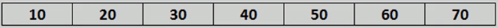
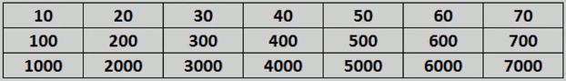
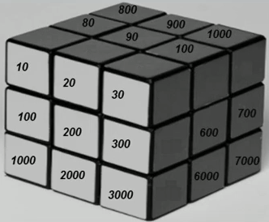

# Array types

An array can be one dimensional or multi-dimensional.

In one dimensional array, each element is represented by a single subscript. The elements are stored in consecutive memory locations.

In multi-dimensional arrays, the simplest form is the two dimensional array, where each element is represented by two subscripts. Thus a two dimensional `m x n` array has m rows and n columns and contains `m*n` elements.

Three dimensional array - each element is represented by three subscripts. Thus a three dimensional `m x n x l` array contains `m*n*l` elements.

