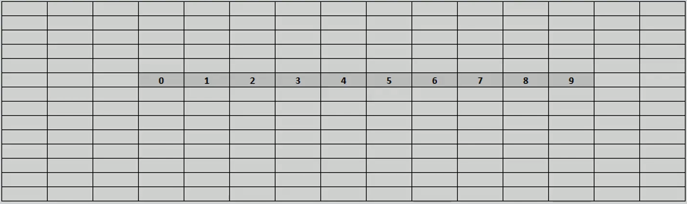
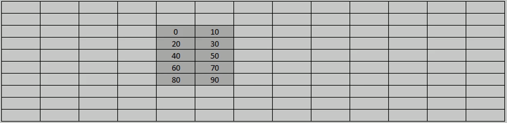
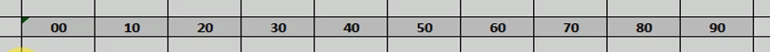
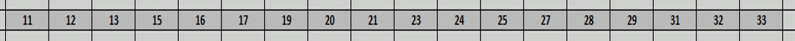

# How array is represented in memory

## One dimensional array

```
Arr[col]
Arr[10] = {0,1,2,3,4,5,6,7,8,8,9};
```

When we tell that we need an array of 10 cells, computer find space for 10 cells in RAM and allocates memory for it. Starting location can vary depending on current memory allocation.



## Two dimensional array

```
Arr[rows][cols]
Array[5][2] = {{00,10}, {20,30}, {40, 50}, {60, 70}, {80, 90}}
```


Same principle can be applied with two dimensional arrays, but it does not allocate memory like this:



Instead it allocates it like this:



## Three dimensional arrays

Same principle goes with 3D arrays.

```
Array[width][row][col]
int arr[2][3][3] = {
    { {11,12,13},{15,16,17},{19,20,21} },
    { {23,24,26},{27,28,29},{31,32,33} }
};
```

