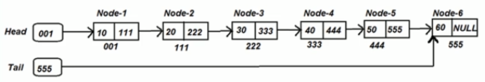
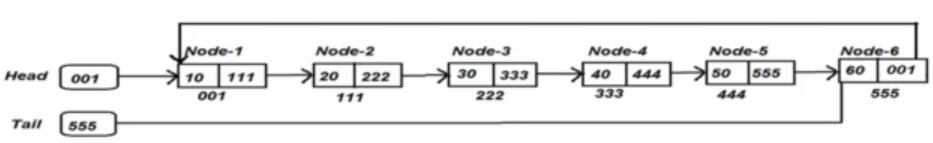
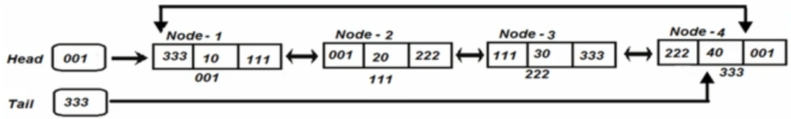

# Types of linked lists

- Single linked list

    each node stores data and reference to the next node

    

- Circular single linked list

    Same as the Single linked list, but the last element also holds a reference to the first element.

    

- Double linked list

    Each node holds 2 references - previous and next node.

    

- Circular double linked list

    Same as double linked list, but last element points to front and front points to end.

    