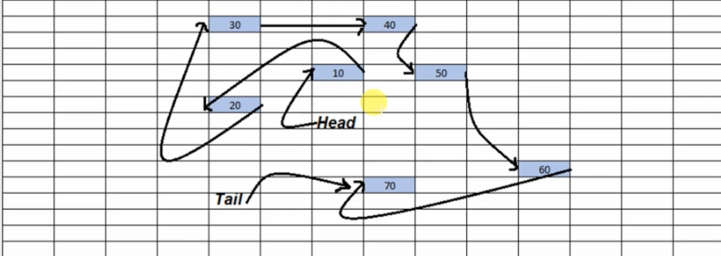

# How is Linked List stored in memory

Here is a representation on how a linked list of 7 elements can be stored in RAM.

We can see that there is a difference on how a linked list is stored in memory vs how an array is stored in memory. Each element can be located at a random memory address, this is the reason why we cannot access n-th element of a linked list without traversing like we can in arrays.