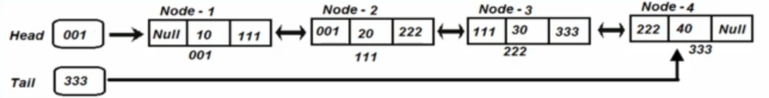

# Double linked list

In double linked list each node contains two references that reference both previous and next nodes, instead of pointing just to the next node like single linked lists do.



## Creation of a double linked list

1. Declare head reference 
2. Declare Tail reference
3. Create an empty node
4. Initialize with some value, head and tail references should be null.
5. Update head to reference the node
6. Update the tail to reference the node

```
CreateDoubleLinkedList(nodeValue):
    create a blank node
    node.value = nodeValue
    head = node
    tail = node
    node.next = node.prev = null;

Time complexity - O(1)
Space complexity - O(1)
```

## Insert a node in double linked list

There can be 3 cases:
- Insert at the start of the linked list
- Insert at the end of linked list
- Insert at any other location

```
insertInLinkedList(head, nodeValue, location):
    create a blank node
    node.value = nodeValue
    if(!existsLinkedList(head))
        return error
    else if (location == 0) // insert at first position
        node.next = head
        node.prev = null
        head.next = node
        head = node
    else if (location == last)
        node.next = null
        node.prev = tail
        tail.next = node
        tail = node
    else // any other location
        loop: tmpNode = 0 to location -1
        node.next = tmpNode.next; 
        node.prev = tmpNode;
        tmpNode.next = node; 
        node.next.prev = node;

Time complexity - O(n)
Space complexity - O(n)
```

## Traverse

```
traverseLinkedList()
    if (head == null)
        return
    
    loop: head to tail
        print currentNode.value

Time complexity - O(n)
Space complexity - O(1)
```

## Search

```
searchNOde(head, nodeValue):
    loop: tmpNode = head to tail
        if(tmpNode.value == nodeValue)
            print tmpNode.value
            return true
    return false

Time complexity - O(n)
Space complexity - O(1)
```

## Delete

```
deleteNode(head, location):
    if(!existsLinkedList(head))
        return error
    else if (location == 0) // first element
        if (this was the only element in list)
            head = tail = null return
        head = head.next;
        head.prev = null
    else if (location >= last)
        if (this was the only element in list)
            head = tail = null return
        tail = tail.prev;
        tail.next = null
    else // any other location
        loop: tmpNode = start to location - 1
        tmpNode.next = tmpNode.next.next
        tmpNode.next.prev = tmpNode

Time complexity O(n)
Space complexity O(1)
```

## Delete entire DLL

```
deleteLinkedList(head, tail):
    loop(tmp : head to tail)
        tmp.prev = null;
        head = tail = null;

Time complexity - O(n)
Space complexity - O(1)
```

## TIme and space complexityies

|                     | Time complexity | Space complexity |
|---------------------|-----------------|------------------|
| Creating            | O(1)            | O(1)             |
| Insertion           | O(n)            | O(1)             |
| Searching           | O(n)            | O(1)             |
| Traversing          | O(n)            | O(1)             |
| Deletion            | O(n)            | O(1)             |
| Deleting whole list | O(n)            | O(1)             |