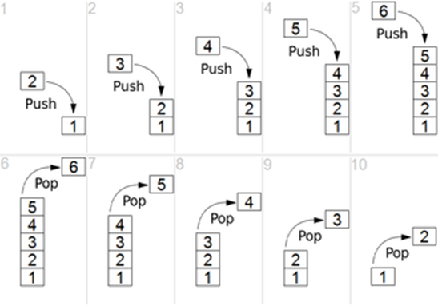

# What and why of stack

Now we are taking a look at our fist logical data structure - stack.

## What is stack

Stack data structure is a list of elements that are pushed into a stack. It has two methods - push and pop.
The stack follows LIFO (last in First out) methodology, which means that the last element you pushed out of the stack, will be the first one to pop.

(image taken from https://www.thecrazyprogrammer.com/2018/01/stack-vs-heap.html)

## Why whould we learn / use stack?

When we need to create an application that uses last incoming data first.

An example for this would be using your browser's history navigation. When you visit a page it pushes the previous one on the history stack, when you press a button to navigate back, it will pop the last site you went.

## Common operations in a stack

- Create stack

    Create a stack structure.

- Push

    Add an element to the stack

- Pop

    Get an element from the stack, remove it from it.

- Peek

    Get an element from the stack without removing it

- isEmpty

    Check if the stack is empty

- isFull

    Check if the stack is full

- deleteStack

    Delete the stack structure