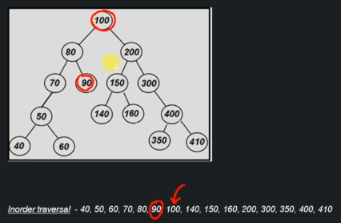

# What is a tree

A tree is a data structure that is used to represent data in a hierarchical form. Every node has 2 components - data that it holds and reference to it's parent.

At the very top it has a root node with a left sub-category and right sub-category under it.


## Tree terminology

```
- Root          - node with no parent
- Edge          - link from parent to child
- Leaf          - node with no children
- Sibling       - children of the same parent
- Ancestor      - parent, it's parents ... of a given node
- Depth         - length of the path from root to node
- Height        - Length of the path from node to the deepest node
- Predecessor   - Immediate previous node inorder traversal of the binary tree
- Successor - immediate next node inorder traversal of the binary tree
```

Predecessor example:



Starts with the left subtree, then root node, then right subtree.

## What is a binary tree

- A tree is called a binary tree if each node has zero, one or two child nodes.
- It is a family of data structure (BST, Heap tree, AVL, Red-Black, Syntax tree, Huffman cofing tree etc.)

Used to solve specific problems like:
- Huffman coding
- Heap (priority queue)
- Expression parsing

## Types of binary trees

- Strict binary tree - if each node has either 2 children or none
- Full binary tree - if each non leaf node has 2 children and all leaf nodes are at same level
- Complete binary tree - if all levels are completely filled except possibly the last level and the last level has all keys as left as possible.


## Common operations

- Creating a tree
- Inserting a node
- Deleting a node
- Searching for a value
- Traversal of all nodes
- Deletion of the tree