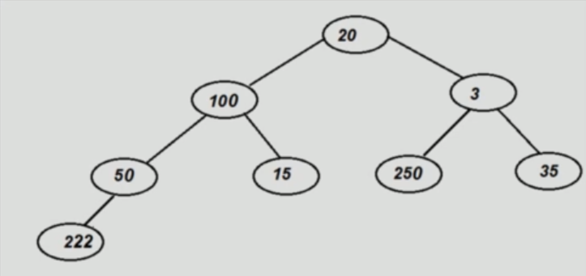
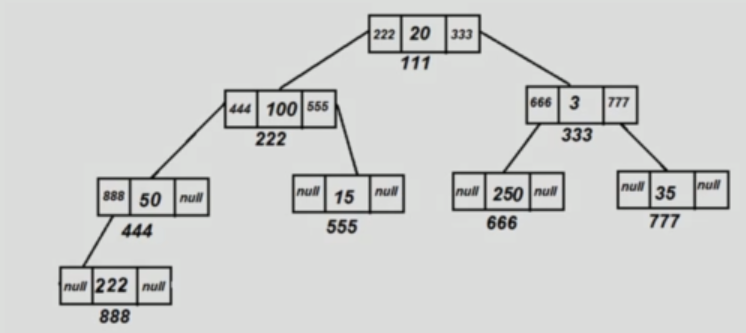
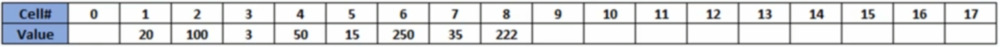

# How tree is represented in code

We can implement trees by using arrays or linked lists.

At the logical level, a tree looks like this:

At the LinkedList implementation, it looks like this:

When implemented with array, a tree will look like this:

Left child - cell[2x]
Right child - cell[2x+1]