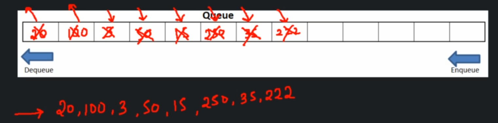

# Implementing binary tree with a Linked List

```
createBinaryTree()
    Create an object of Binary Tree class

Time complexity - O(1)
Space complexity - O(1)
```

```
preOrderTraversal(root) ---------------- T(n)
    if(root == null) -------------- O(1)
        return error -------------- O(1)
    print root -------------------- O(1)
    preOrderTraversal(root.left) -- T(n/2)
    preOrderTraversal(root.right) - T(n/2)

Time complexity - O(n)
Space complexity - O(n)
```

```
inOrderTraversal(root) ---------------- T(n)
    if root == null -------------- O(1)
        return error ------------- O(1)
    inOrderTraversal(root.left) -- T(n/2)
    print root ------------------- O(1)
    inOrderTraversal(root.right) - T(n/2)

Time complexity - O(n)
Space complexity - O(n)
```

```
postOrderTraversal(root) ---------------- T(n)
    if root == null ---------------- O(1)
        return error --------------- O(1)
    postOrderTraversal(root.left) -- T(n/2)
    postOrderTraversal(root.right) - T(n/2)
    print root --------------------- O(1)

Time complexity - O(n)
Space complexity - O(n)
```

```
levelOrderTraversal(root)
    create a queue(Q) -------------------- O(1)
    enqueue(root) ------------------------ O(1)
    while(queue is not empty) ------------ O(n)
        enqueue child of first element --- O(1)
        dequeue and print ---------------- O(1)

Time complexity - O(n)
Space complexity - O(n)
```




```
searchTree(value)
    if root == null ----------------- O(1)
        return error ---------------- O(1)
    do a level order traversal ------ O(n)
        if value found -------------- O(1)
            return true ------------- O(1)
    return false -------------------- O(1)

Time complexity - O(n)
Space complexity - O(n)
```

```
insertNode():
    if root is blank
        insert new node at root
    else
        do a level order traversal and find the first blank space
        insert that blank space

Time complexity - O(n)
Space complexity - O(n)
```

```
deleteNode()
    search for the node to be deleted
    find deepest node in the tree
    copy deepest node's data in current node
    delete deepest node

Time complexity - O(n)
Space complexity - O(n)
```

```
DeleteBinaryTree()
    root = null

Time complexity - O(1)
Space complexity - O(1)
```

## Time and space complexity

|              | Time complexity | Space complexity |
|--------------|-----------------|------------------|
| create tree | O(1)            | O(n)             |
| insert value      | O(n)            | O(n)             |
| delete value      | O(n)            | O(n)             |
| search         | O(n)            | O(n)             |
| traverse      | O(n)            | O(n)             |
| delete tree       | O(1)            | O(1)             |