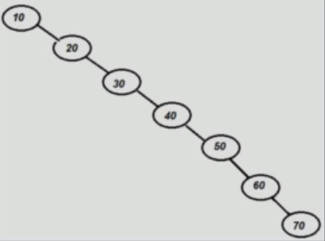
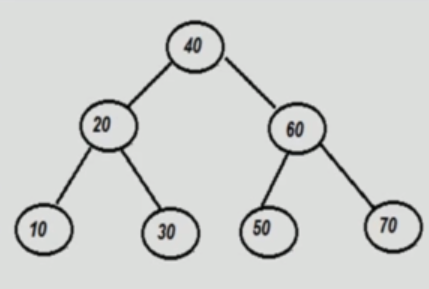

# What is an AVL tree

## Why AVL tree?

When we would need to insert numbers like 10,20,30,40,50,60,70 in BST, only the the right side will be occupied of each child.

When searching for 60, it will traverse to the right and find the node we are looking for, which is fine. 

However, the problem is that we traversed 6 objects until we found it. If we would represent the tree in a more balanced way, it would save time.

This tree would take us only 2 iterations.

-----------

So, the lesson is that depending on incoming data, a BST can get skewed and hence it's performance starts going down. Instead of O(log n) it can go up to O(n).

The AVL tree attempts to solve this problem of `skewing` by introducting concept called `Rotation`.

## What is AVL tree?

An AVL tree is a balanced Binary Search Tree where the height of immediate subrtrees of any node differs by at most one (also called balance factor).

If at any time heights differ by more than one, rebalancing is done to restore this property (called rotation).

Empty height is always considered -1.

## Common operations of AVL

- Create an AVL tree
- Search a node
- Traverse all nodes
- Insert a node
- Delete a node
- Delete AVL tree

