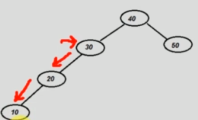
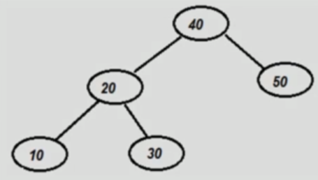
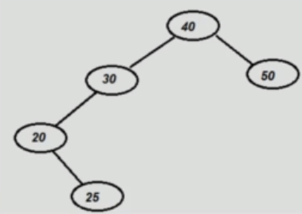
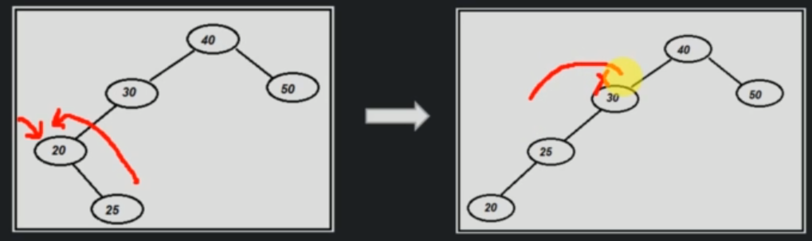
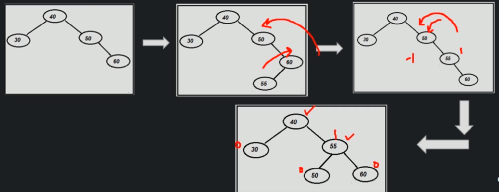

# AVL implementation

```
createAVL()
    root = null

Time complexity  - O(1)
Space complexity - O(1)
```

```
searchAVL(root, value)
    if( root is null )
        return null
    else if root == value
        return root
    else if value < root
        searchAVL(root.left, value)
    else if value > root
        searchAVL(root.right, value)

Time complexity  - O(log n)
Space complexity - O(log n)
```

```
preOrderTraversal(root)
    if root == null
        return error
    
    print root
    preOrderTraversal(root.left)
    preOrderTraversal(root.right)

Time complexity  - O(n)
Space complexity - O(n)
```

```
inOrderTraversal(root)
    if root == null
        return error
    
    inOrderTraversal(root.left)
    print root
    inOrderTraversal(root.right)
    
Time complexity  - O(n)
Space complexity - O(n)
```

```
postOrderTraversal(root)
    if root == null
        return error
    
    postOrderTraversal(root.left)
    postOrderTraversal(root.right)
    print root

Time complexity  - O(n)
Space complexity - O(n)
```

```
levelOrderTraversal(root)
    create a queue
    enqueue(root)
    while(queue not empty)
        dequeue and print
        enqueue children

Time complexity  - O(n)
Space complexity - O(n)   
```

Now, the insertion and deletion operations are a little bit more complicated in case of AVL trees.

When we want to insert a node in AVL tree, there can be 2 cases:
1. When `rotation` is not required
2. When `rotation` is required (LL, LR, RR, RL)

We can determine whether we need rotation by checking if any nodes left tree and right tree height differs by more than 1 level.

When we want to do a rotation, there are there can be 4 conditions.

### 1. Left Left condition

Disbalanced node's grandchild is located on left, left subtree.



We do a right rotation:



```
rightRotate(currentDisbalancedNode)
    newRoot = currentDisbalancedNode.left
    currentDisbalancedNode.left = currentDisbalancedNode.left.right
    newRoot.right = currentDisbalancedNode
    currentDisbalancedNode.height = calculateHeight(currentDisbalancedNode)
    newRoot.height = calculateHeight(newRoot)

Time complexity - O(1)
Space complexity - O(1)
```

### 2. Left Right condition (LR)

Disbalanced node's grandchild is located in Left-Right position.



We do a left rotation, but on the disbalanced node's child position.



Then we can do a `right rotation`.

```
leftRotate(currentDisbalancedNodesLeftChild)
    newRoot = currentDisbalancedNodesLeftChild.right
    currentDisbalancedNodesLeftChild.right = currentDisbalancedNodesLeftChild.right.left
    newRoot.left = currentDisbalancedNodesLeftChild
    currentDisbalancedNodesLeftChild.height = calculateHeight(currentDisbalancedNodesLeftChild)
    newRoot.height = calculateHeight(newRoot)
    return newRoot

Time complexity - O(1)
Space complexity - O(1)
```

### 3. Right Right contidition (RR)

It is exactly opposite of the LL condition.
We apply leftRotate, but on the disbalancedNode instead of it's left child like in the LR condifition.

```
leftRotate(currentDisbalancedNode)
    newRoot = currentDisbalancedNode.right
    currentDisbalancedNode.right = currentDisbalancedNode.right.left
    newRoot.left = currrentDisbalancedNode
    CurrentDisbalancedNode.height = calculateHeight(currentDisbalancedNode)
    newRoot.height = calculateHeight(newRoot)
    return newRoot

Time complexity - O(1)
Space complexity - O(1)
```

### 4. Right Left condition (RL)

We do a right rotation on disbalanced node's child.  Then left rotation on the disbalanced node.



```
rightRotate(currentDisbalancedNodesRightChild)
    newRoot = currentDisbalancedNodesRightChild.left
    currentDisbalancedNodesRightChild = currentDisbalancedNodesRightChild.left.right
    newRoot.right = currentDisbalancednodesRightChild
    currentDisbalancedNodesRightChild.height = calculateHeight(currentDisbalancedNodesRightChild)
    newRoot.height = calculateHeight(newRoot)
    return newRoot

Time complexity - O(1)
Space complexity - O(1)
```

```
leftRotate(currentDisbalancedNode)
    newRoot = currentDisbalancedNode.right
    currentDisbalancedNode.right = currentDisbalancedNode.right.left
    newRoot.left = currrentDisbalancedNode
    CurrentDisbalancedNode.height = calculateHeight(currentDisbalancedNode)
    newRoot.height = calculateHeight(newRoot)
    return newRoot

Time complexity - O(1)
Space complexity - O(1)
```

### Insert, end-to-end case

We are going to construct an example where all of the previously mentioned cases will be called.

```
Node insert( Node root, int data )
    if(root == null) return new Node(data) // BST condition
    else if (data <= root.data ) root.left = insert(root.left, data) // BST condition
    else root.right = insert(root.right, data) // BST condition

    int balance = height(root.left) - height(root.right)

    if(balance > 1) // if left subree is overloaded
        if( height root.left.left >= height(root.left.right) )
            RightRotation(root) // LL condition
        else // LR condition
            LeftRotation(root.left)
            RightRotation(root)
    else if (balance < -1) // if right subtree is overloaded
        if height(root.right.right) >= height(root.right.left)
            LeftRotation(root) // PR condition
        else // RL condition
            return RightRotation(root.right)
            LeftRotation(root)
    
    root.height = max(root.left, root.right) + 1

    return root

Time complexity - O(log n)
Space complexity - O(log n)
```

### Deletion of a node

There can be 3 cases:
1. Tree does not exist
2. Rotation is not required (BST conditions)
3. Rotation is required

```
deleteNode(currentNode, valueToBeDeleted):
    
    if(currentNode === null) return null
    if(valueToBeDeleted < currentNode.value)
        currentNode.left = deleteNode(currentNode.left, valueToBeDeleted)
    else if (valueToBeDeleted > currentNode.value)
        currentNode.right = deleteNode(currentNode.right, valueToBeDeleted)
    else
        if current node have both children then find minimum element from right subtree (case 3)
            retplace current node with minimum node from right subree and delete minimum node from right
        else if nodeToBeDeleted has only left child (case 2)
            currentNode = currentNode.left
        else if nodeToBeDeleted has only right child (case 2)
            currentNode = currentNode.right
        else // if nodeToBeDeleted do not have any children (case 1)
            currentNode = null

    int balance = checkBalance(currentNode.left, currentNode.right)

    if(balance > 1)
        if(checkBalance(currentNode.left.left, currentNode.left.right) > 0) 
            currentNode = rightRotate(currentNode) // LL condition
        else
            currentNode.left = leftRotate(currentNode.left) // LR
            currentNode = rightRotate(currentNode)
    else if balance < -1
        if(checkBalance(currentNode.right.right, currentNode.right.left) > 0)
            currentNode = leftRotate(currentNode) // RR
        else
            currentNode.right = rightRotate(currentNode.right) // RL
            currentNode = leftRotate(currentNode)

    if(currentNode.left !== null)
        currentNode.left.setHeight(calculateHeight(currentNode.left)
    if(currentNode.right !== null)
        currentNode.right.setHeight(calculateHeight(currentNode.right)

    currentNode.setHeight(calculateHeight(currentNode));

    return currentNode

Time complexity - O(log n)
Space complexity - O(log n)
```

### Deletion of entire AVL tree

```
delete()
    root = null

Time complexity - O(1)
Space complexity - O(1)
```

When we set the root to null, automatically it's children are orphaned and garbage collector deletes the entire tree.

## Time & Space complexity in AVL tree

|              | Time complexity | Space complexity |
|--------------|-----------------|------------------|
| create tree | O(1)            | O(1)             |
| insert value      | O(log n)            | O(log n)             |
| delete value      | O(log n)            | O(log n)             |
| search         | O(log n)            | O(log n)             |
| traverse      | O(n)            | O(n)             |
| delete tree       | O(1)            | O(1)             |