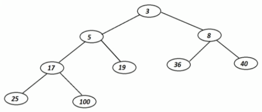

# Binary heap operations


## Implementation options

- Array based
- Reference / pointer based implementation

## Array representation

At the logical level, the Binary Heap looks like this:



The binary heaps looks like this in the array implementation:


```
Left child - cell[2x]
Right child - cell[2x+1]
```

```
createHeap(size)
    create a blank array of size+1
    initialize sizeOfHeap with 0

Time complexity - O(1)
Space complexity - O(n)
```

```
peekOfTop()
    if tree does not exist
        return error
    return first cell of array

Time complexity - O(1)
Space complexity - O(1)
```

```
sizeOfHeap()
    return sizeOfHeap // number of cells used in heap array
```

```
insertValueInHeap(value)
    if tree does not exist
        return error
    else
        insert value in first unused cell of array
        sizeOfHeap++
        heapifyBottomToTop(sizeOfHeap)

Time complexity - O(log n)
Space complexity - O(log n)
```

```
extractMin()
    if tree does not exist
        return error
    
    extract 1st cell of array
    promote last element to first
    sizeOfHeap--
    heapifyTopToBottom(1)

Time complexity - O(log n)
Space complexity - O(log n)
```

```
deleteHeap()
    set array to null

Time complexity - O(1)
Space complexity - O(1)
```

## Why avoid using reference based implementation?

When we extract from the heap, we delete the first note, get the last node and bring it to the top. 

When using references, there is no way we can find out the last element of the tree in `O(log n)` time.