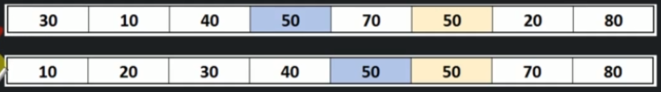
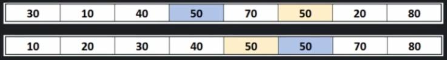

# What is sorting?

Sorting refers to arranging data in a particular format: either ascending or descending order.

## Types of sorting

Every sorting algorithm can be divided into following categories:

- On the basis of space used
    - in-place
    - out-of-place
- On the basis of stability
    - stable
    - un-stable

## In-place vs Out-place sorting

- In-place Sort:
    - Sorting algorithms which does not require any extra space for sorting.
    - Example - bubble sort.
- Out-of-place Sort:
    - Requires extra space for sorting
    - Example - Merge Sort

## Stable vs Unstable sorting

- Stable Sort:
    - If a Sorting algorithm after sorting the contents does not change the sequence of similar content in which they appear, is called stable sorting.
    - Example - insertion sort

    

- Unstable Sort:
    - If a sorting algorithm after sorting the contents, changes the sequence of similar content in which they appearm it is called unstable sort.
    - Example: quick sort

    

## Sorting terminologies

- Increasing order - if successive element is greater than previous one.
- Decresing order - if successive element is less than the current one.
- Non-increasing order - if successive element is less than or equal to it's previous element in the sequence. This order occurs when the sequence contains duplicate values.
- Non-decreasing order - if the successive element is greater than or equal to it's previous element in the sequence. This order occurs when there are duplicate values.