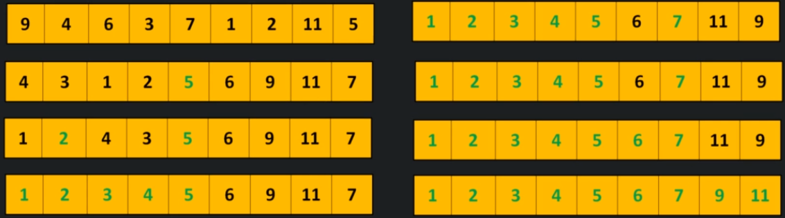

# Quick sort

Quick sort is a divide and conquer algorithm.

At each step it finds `Pivot` and then makes sure that all the smaller elements are left of `Pivot` and all bigger elements are right of it.

It does this recursively until the entire array is sorted.

Unlike merge sort, it does not require any external space.



```
QuckSort(A, p, q)
    if(p < q)
        r = partition(A, p, q)
        QuickSort(A,p,r-1)
        QuickSort(A, r+1, p)

Partition(A, p, q)
    pivot = q
    i = p -1

    for (j = p to q)
        if(A[i] < A[pivot])
            increment i and then swap(A[i], [j])

Time complexity - O(n log n)
Space complexity - O(n)
```

## When to use
- When average case is desired to be O(n log n)

## When to avoid
- When space is a concern
- When stable sort is required

