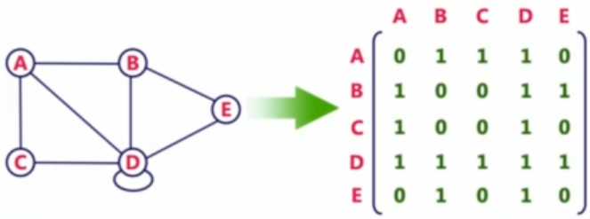
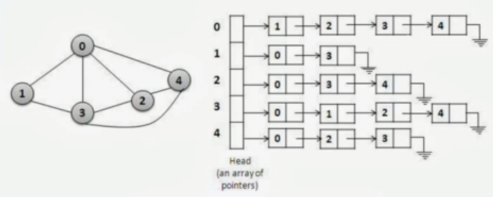

# Graph representation in code

We can use adjacency matrix to represent the graph in code.

An adjacency matrix is a square matrix used to represend a finite graph. The elements of the matrix indicate whether pairs of vertices are adjacent or not in the graph.

We can also use an adjacency list, which is a collection of unordered lists used to represent a finite graph. Each list describes a set of neighbors of a vertex in the graph.

## When to use each representation

- If the graph is a complete or near to complete graph, then we should use adjacency matrix.
- If the number of edges are few, then we should use adjacency list.

