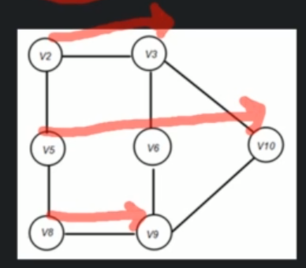
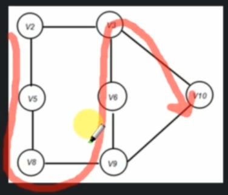

# Graph traversal

Graph traversal refers to the process of visiting each vertex in a graph.

There can be 2 types of traversal techniques:
- Breadth First Search (BFS)
- Depth First Search (DFS)

## Breadth First Search (BFS)

BFS is an algorithm for traversing Graph Data Structures. It starts at some arbitrary node of a graph and explores the neighbor nodes (which are at current level) first, before moving to the next neighbors.



```
BFS(G)
    while all the vertices are not explored, do:
        enqueue(any evertex)
        while Q is not empty
            p = Dequeue()
            if p is unvisited
                print p and mark p as visited
                enqueue(all adjacent unvisited vertices of p)

Time complexity - O(V + E)
Space complexity - O(V + E)
```

One corner case of the BFS is - disconnected graph. When there are vertices that are not connected to any other vertices - they will not be traversed.

## Depth First Search (DFS)

Depth First Search (DFS) is an algorithm for traversing graph data structures. It starts selecting some arbitrary node and explores as far as possible along each edge before backtracing.




```
DFS()
    while all the vertices are not explored, do:
        push(any vertex)
        while Stack is not empty
            p = pop()
            if p is unvisited
                print p and mark p as visited
                push(all unvisited adjacent vertices of p)

Time complexity - O(E + V)
Space complexity - O(E + V)
```

Same thing as the BFS - the DFS method will not look at any vertices that are disconnected from the graph.

## DFS vs BFS

|                         | DFS                                                        | BFS                                                       |
|-------------------------|------------------------------------------------------------|-----------------------------------------------------------|
| How it works internally | It goes in `depth` first                                   | It goes in `breadth` first                                |
| Internally uses         | Stack                                                      | Queue                                                     |
| Time Complexity         | O(E + V)                                                   | O(E + V)                                                  |
| Space Complexity        | O(E + V)                                                   | O(E + V)                                                  |
| When to use which?      | If we already know that target vertex is buried very deep. | If we know that target vertex is close to starting point. |