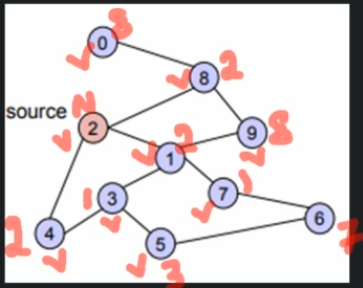
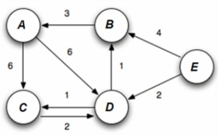
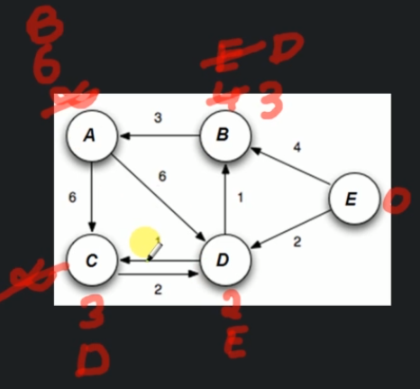
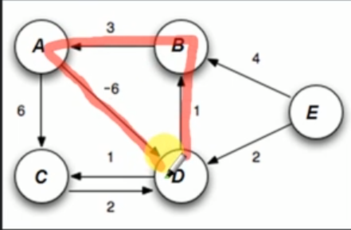
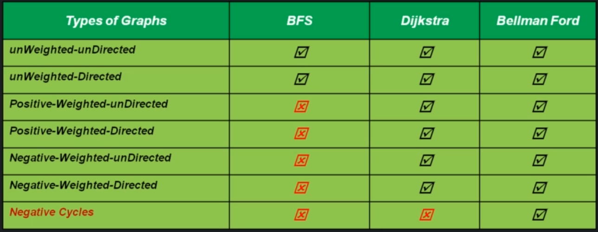
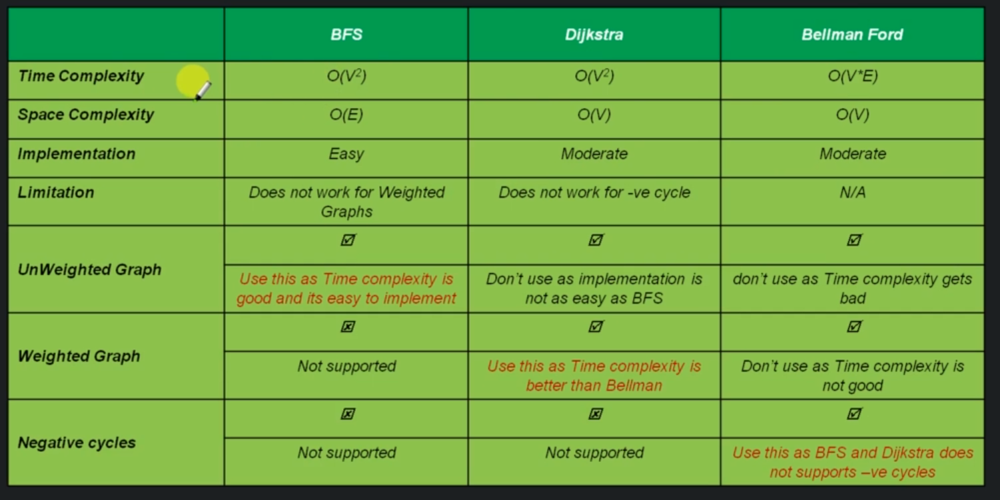

# Single Source Shortest Path Problem (SSSP)

Single source shortest path problem is about finding a path between a given vertex (called source) to all other vertices in a graph such that, the total distance between them (source / destination) is minimum.

We can use several methods to do this:
- Breadth First Search (BFS)
- Dijkstra
- Bellman Ford

## Breadth First Search (BFS)

BFS can be modified to find a Single source shortest path. We need an extra variable `parent` to keep track of the path.

```
bfsForSSSP(any starting vertex)
    initialize Queue
    Create a parent reference in each node
    Enqueue (Source Vertex)
    do while queue is not empty
        currentVertex = Dequeue(vertex)
        for each adjacent vertices
            if adjacent vertex is not visited
                enqueue adjacent vertex and update their parent as currentVertex. Also mark currentVertex as visited.

Time Complexity - O(E)
Space Complexity - O(E)
```



BFS explores a graph only in `breadth-way`, but there can always be a better route which is not `breadth-way`. This will not work for weighted graphs.

## Why DFS does not work for SSSP

  The DFS is used for going `depth-first` and then backtrack. Which basically will find the path with the most depth.

## Dijkstras algorithm



```
Dijkstra(G)
    Set the distance of all the vertices as infinite and source vertex as 0.

    Save all the vertices in minHeap

    do while minHeap is not empty
        currentVertex = extract from minHeap
        for each neighbour of currentVertex
            if current vertex's distance + currentEdge < neighbours distance
                update neighbours distance and parent

Time Complexity - O(V^2)
Space Complexity - O(V)
```



The Dijkstra's algorithm will not work for negative cycles.
A path is called a negative cycle if:
- There is a cycle ( A cycle is a path of edges and vertices wherein a vertex is reachable from itself).
- Total weight of cycle should be a negative number.



This is because we can nver find minimum distance in a negative cycle. 

## Bellman Ford algorithm

The advantage of Bellman Ford's algorithm is that it will work with negative cycles.

If a graph contains a negative cycle that is reachable from the source, then there is no cheapest path: any path that has a point on the negative cycle can be made cheaper by one more walt around the negative cycle. In such a case, the Bellman-Ford algorithm can detect `negative cycles` and report their existence.

```
BellmannFord(G)
    set all vertex distances to infinite and source as 0
    for 1 to v-1:
        for each edge(u,v)
            ifd(V) > d(u) + w(u, v) // if current weight of V is greater than current weight of U + current edge
            d(V) = d(u) + w(u,v)
            update parent of `V`
    
    for each edge(u, v)
        if d(V) != d(u) + w(u, v)
            then report existance of negative-weight cycle

    print all vertices with distances and parents

Time complexity - O(VE)
Space complexity - O(V)
```

The algorithm basically does:
1. It is trying to see if any node achieved a better distance in the previous iteration
2. Then in the current step it tries to use that better distance and improve it of other vertices
3. Now the issue can happen in case
    -   The graph is skewed/biased (what can be the max distance from source to destination?)
    - Processing of edges are happening in unfavourable way
        - resulting in deffering calculation of `distance` for farthest vertex
        What can be farthest vertex from source V-1.

## Comparison of algorithms



