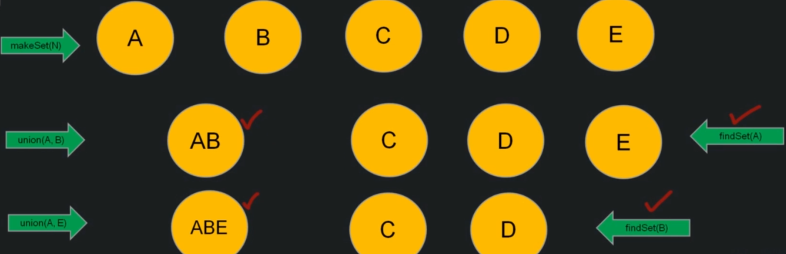
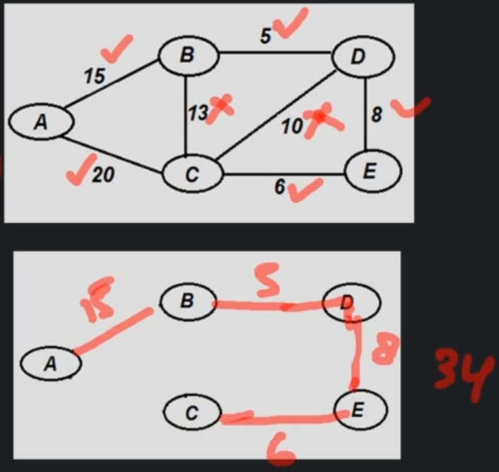
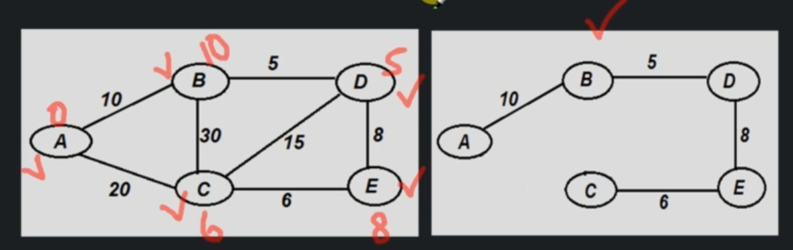
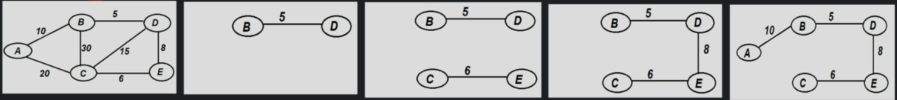
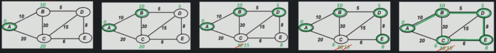

# Minimum Spanning Tree (MST)

A minimum spanning tree (MST) is a subset of the edges of connected, weighted, undirected graph that:
- Connects all the vertices together
- Without any cycles
- With a minimum total edge weight.

Example problem:
- We have 5 islands that we need to connect with bridges
- Cost of each bridge varies depending on different factors
- Which bridge to be constructed and which not? How to find?


## Disjoint set

A Disjoint set is a data structure that keeps track of set of elements which are partitioned into a number of disjoint and non-overlapping sets.

Each set has a representative, which helps in identifying that set.

This One of which is Kruskal Algorithm where it is used to detect cycle in underected graph.

### Common operations in Disjoint Set

- makeSet(n) - used only once to create initial set
- union(x,y) - used to merge both of the sets
- findSet(x) - returns the set name in which element is there



```
createSet(N)
    create n sets for `N` elements

Time complexity - O(n)
Space complexity - O(n)
```

```
union(s1, s2)
    if s1 and s2 are in the same set then return
    if s1 is bigger then merge s2 into s1
    else s2 into s1
    return merged set

Time complexity - O(n)
Space complexity - O(1)
```

```
findSet(x)
    return representative of set in which element x is there

Time complexity - O(1)
Space complexity - O(1)
```

## Kruskals Algorithm

Kruskals algorithm is a greedy algorithm. It finds a minimum spanning tree for a connected weighted graph by:
- Adding increasing arcs at each step
- Also avoiding cycle in every step

```
mstKruskal(G)
    for each vertex: makeSet(X)
    sort each edge in non-decresing order by weight
    for each edge(u,v) do:
        if findSet(u) != findSet(v)
            Union(u,v)
            cost = cost + edge(u,v)

Time complexity - O(E logE)
Space complexity - O(E + V)
```




## Prims Algorithm

Prims algorithm is a greedy algorithm. Take any Vertex as Source and mark weight of all the vertices as infinite and source as 0. 

- For every adjacent unvisited vertex of current vertex 
- if current weight of this adjacent vertex is more than current edge, then update adjacent vertex's weight. 
- Mark currentVertex as visited. 
- Do above steps for all the vertices in increasing order of weights.



```
mstPrims(G)
    create a PriorityQueue(Q)
    insert all the vertices into Q such that key value of starting vertex is 0 and others are infinite

    while Q is not empty:
        currentVertex = dequeue(Q)
        for every adjacent unvisited Vertex of currentVertex
            if current weight of this adjacent vertex is more than current edge
                update adjacent vertex's distance and parent
        mark currentVertex as visited
    print all the vertices with Weights

Time complexity - O(E logV)
Space complexity - O(V)
```

## Algorithm comparison

The Kruskal's algorithm concentrates on edges, finalizes edge in every iteration. 



The Prim's algorithm concentrates on vertices, finalizes vertices in every iteration.

