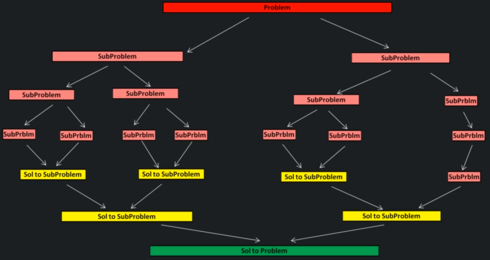

# What is Divide and Conquer

Divide & conquer is an algorithm design paradigm which works by recursively breaking down a problem into sub-problems of similar type, until these become simple enough to be solved directly. The solutions to add the sub-problems are then combined to give a solution to the original problem.

## Properties of Divide and Conquer

    Optimal substructure:
    
    Any problem has optimal substructure property if it's overall optimal solution can be constructed from the optimal solutions of it's subproblem. 
    
    Example: Fib(n) = Fib(n - 1) + Fib(n - 2).

Divide and conquer is most effective when problem has optimal substructure property like it is in Merge Sort, Quick Sort and Binary Search algorithms.

