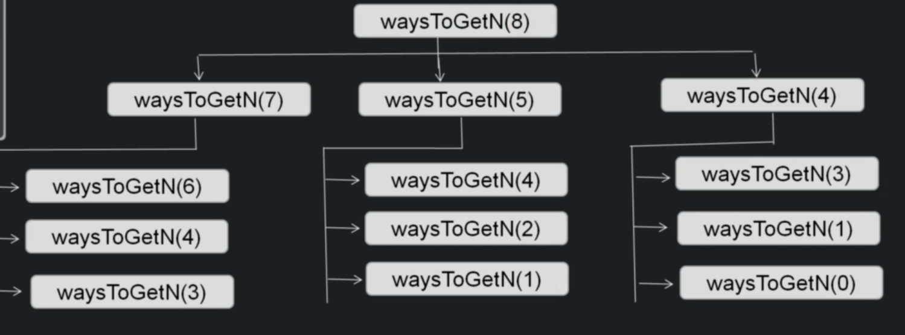

# Nubmer factor

Problem statement: given N, count the number of ways to express N as sum of 1, 3 and 4.

## Example:
n = 4
Number of ways = 4
Explanation: Following are the four ways we can express n: {4}, {1,3}, {3,1}, {1,1,1,1}

## Example 2
n = 5
Number of ways = 6
{4,1}, {1,4}, {3,1,1}, {1,1,3}, {1,1,1,1,1}

## Applying magic framework

If we would apply the magic framework to this problem, we would see that:

1. The greedy choice is not applicable here.

    That is because we can't really tell if we have taken the best sub-solution result - we can't tell if we pick number 1 that is the best pick of all the numbers.

2. It does have an optimal substructure.

    We can break down the problem in smaller, similar sub-problems. 

## The algorithm

```
public int waysToGetN(int n)

    if(n == 0 || n == 1 || n == 2) // {}, {1}, {1,1} base cases
        return 1
    if(n == 3)
        return 2 //{1,1,1}, {3}

    int subtract1 = waysToGetN(n-1)
    int subtract1 = waysToGetN(n-3)
    int subtract1 = waysToGetN(n-4)
    return subtract1 + subtract3 + subtract4
```

