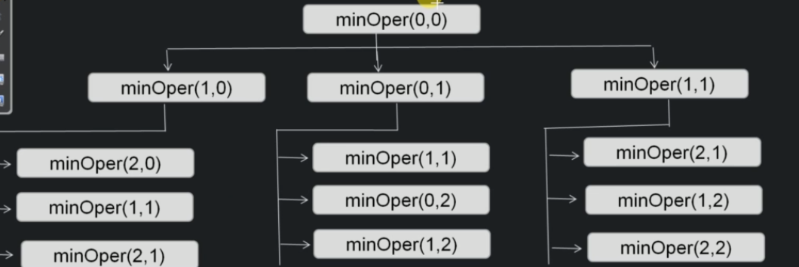

# Convert one string to another

```
private int findMinOperationsAux(String s1, String s2, int i1, int i2)

    if i1 == s1.length // if we have reached the end of s1, so rest of the characters of s2 needs to be deleted.
        return s2.length - i2
    if i2 == s2.length // we have reached the end of s2, so rest of the characters needs to be inserted in s2
        return s1.length - i1
    if s1.charAt(i1) == s2.charAt(i2) // if string have a matching character, recursively match for the remaining lengths
        return findMinOperationsAux(s1, s2, i1+1, i2+1)

    int c1 = 1 + findMinOperationsAux(s1,s2,i1 + 1, i2) // insertion
    int c2 = 1 + findMinOperationsAux(s1,s2,i1, i2+1) // deletion
    int c3 = 1 + findMinOperationsAux(s1,s2,i1 + 1, i2 + 1) // replacement

    return Min(c1, c2, c3)
```



## Top Down approach

```
private int findMinOperationsRecursive(integer[][] dp, String s1, String s2, int i1, int i2)

    if dp[i1][i2] == null
        
        if i1 == s1.length // if we have reached the end of s1, so rest of the characters of s2 needs to be deleted.
            return s2.length - i2
        if i2 == s2.length // we have reached the end of s2, so rest of the characters needs to be inserted in s2
            return s1.length - i1
        if s1.charAt(i1) == s2.charAt(i2) // if string have a matching character, recursively match for the remaining lengths
            return findMinOperationsAux(s1, s2, i1+1, i2+1)

        int c1 = 1 + findMinOperationsAux(s1,s2,i1 + 1, i2) // insertion
        int c2 = 1 + findMinOperationsAux(s1,s2,i1, i2+1) // deletion
        int c3 = 1 + findMinOperationsAux(s1,s2,i1 + 1, i2 + 1) // replacement

        dp[i1][i2] = 1+ Math.min(c1, c2, c3)

    return dp[i1][i2]

```

## Bottom Up approach

```
int findMinOperations(String s1, String s2)

    int[][] dp = new int[s1.length +1][s2.length + 1];
    
    for int i1 = 0; i1 < s1.length; i++
        dp[i1][0] = i1

    for int i2 = 0; i2 < s2.length; i2++
        dp[i2][0] = i2

    for int i1 = 1; i1 <= s1.length; i1++
        for int i2 = 1; i2 <= s2.length; i2++
            if s1.charAt(i1 - 1) == s2.charAt(i2 - 1)
                dp[i1][i2] = dp[i1 - 1][i2 - 1]
            else
                dp[i1][i2] = 1 + Math.min(dp[i1 - 1][i2], dp[i1][i2-1], dp[i1-1][i2-1])

    return dp[0][0]

```