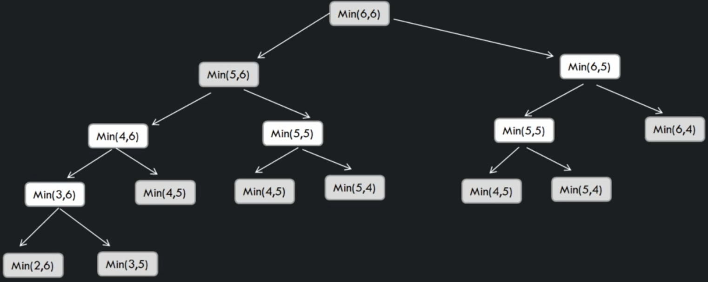

# Min cost to reach last cell in 2D array

```
int findMinCost(int[][] cost, int row, int col)
    
    if row == -1 || col == -1
        return Integer.MAX_VALUE
    
    if row == 0 && col == 0
        return cost[0][0]

    int minCost1 = findMinCost(cost, row-1, col) // get min cost if we go up

    int minCost2 = findMinCost(cost, row, col -1) // left
    
    int minCost = integer.min(minCost1, minCost2)
    int currentCollsCost = cost[row][col]

    return minCost + currentCellsCost

```



## Top Down approach

```
int findMinCost_aux(int[][] dp, int[][] array, int row, int col)

    if row == -1 || col == -1
        return Integer.MAX_VALUE
    
    if row == 0 && col == 0
        return array[0][0]

    if dp[row][col] == 0
        int minCost1 = findMinCost_aux(dp, array, row - 1, col)
        int minCost2 = findMinCost_aux(dp, array, row, col - 1)
        int minCost = Integer.min(minCost1, minCost2)
        int currentCellsCost = array[row][col]

        dp[row][col] = minCost + currentCellsCost
    
    return dp[row][col]
```

## Bottom up

```
int findMinCost(int[][] array, int row, int col)

    int[][] dpo = new int[row + 1][col + 1]

    for int i = 0; i <= col; i++
        dp[0][i] = Integer.MAX_VALUE
    
    for int i = 0; i <= row; i++
        dp[i][0] = Integer.MAX_VALUE

    dp[0][1] = 0

    for int i = 1; i <= row; i ++
        for int j = 1; j <= col; j++
            dp[i][j] = Integer.min(dp[i-1][j], dp[i][j-1] + array[i-1][j-1])

    return dp[row][col]

```