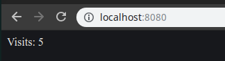

# Docker compose commands

We can use `docker-compose up` to run something like `docker run <image>` for each service in the `docker-compose.yml`.
If we want to build or rebuild images, we can use `docker-compose up --build`.

You can use `-d` to start them in background / detached mode.

```
davis@davis-arch  ~/projects/docker/03_visits   master ●  docker-compose up --build
Building node-app
Step 1/6 : FROM node:alpine
 ---> ebbf98230a82
Step 2/6 : WORKDIR /app
 ---> Using cache
 ---> 93b2648262c0
Step 3/6 : COPY package.json .
 ---> Using cache
 ---> 475937e9ad91
Step 4/6 : RUN npm install
 ---> Using cache
 ---> 7bec86db7832
Step 5/6 : COPY . .
 ---> b05a3e5a00ac
Step 6/6 : CMD ["npm", "start"]
 ---> Running in 4bd60eba1461
Removing intermediate container 4bd60eba1461
 ---> 1d9a755bfa0f
Successfully built 1d9a755bfa0f
Successfully tagged 03_visits_node-app:latest
Starting 03_visits_redis-server_1            ... done
Recreating 0dce2607593a_03_visits_node-app_1 ... done
Attaching to 03_visits_redis-server_1, 03_visits_node-app_1
redis-server_1  | 1:C 02 Feb 2019 09:44:39.477 # oO0OoO0OoO0Oo Redis is starting oO0OoO0OoO0Oo
redis-server_1  | 1:C 02 Feb 2019 09:44:39.477 # Redis version=5.0.3, bits=64, commit=00000000, modified=0, pid=1, just started
redis-server_1  | 1:C 02 Feb 2019 09:44:39.477 # Warning: no config file specified, using the default config. In order to specify a config file use redis-server /path/to/redis.conf
redis-server_1  | 1:M 02 Feb 2019 09:44:39.479 * Running mode=standalone, port=6379.
redis-server_1  | 1:M 02 Feb 2019 09:44:39.479 # WARNING: The TCP backlog setting of 511 cannot be enforced because /proc/sys/net/core/somaxconn is set to the lower value of 128.
redis-server_1  | 1:M 02 Feb 2019 09:44:39.479 # Server initialized
redis-server_1  | 1:M 02 Feb 2019 09:44:39.479 # WARNING overcommit_memory is set to 0! Background save may fail under low memory condition. To fix this issue add 'vm.overcommit_memory = 1' to /etc/sysctl.conf and then reboot or run the command 'sysctl vm.overcommit_memory=1' for this to take effect.
redis-server_1  | 1:M 02 Feb 2019 09:44:39.479 # WARNING you have Transparent Huge Pages (THP) support enabled in your kernel. This will create latency and memory usage issues with Redis. To fix this issue run the command 'echo never > /sys/kernel/mm/transparent_hugepage/enabled' as root, and add it to your /etc/rc.local in order to retain the setting after a reboot. Redis must be restarted after THP is disabled.
redis-server_1  | 1:M 02 Feb 2019 09:44:39.479 * DB loaded from disk: 0.000 seconds
redis-server_1  | 1:M 02 Feb 2019 09:44:39.479 * Ready to accept connections
node-app_1      | 
node-app_1      | > @ start /app
node-app_1      | > node index.js
node-app_1      | 
node-app_1      | Listening on port 8080
```

If we visit the [https://localhost:8080](http://localhost:8080) now:



## Stopping docker-compose containers

To stop the docker-compose containers:

```
docker-compose down
```

```
davis@davis-arch  ~/projects/docker/03_visits   master  docker-compose up -d      
Starting 03_visits_redis-server_1 ... done
Starting 03_visits_node-app_1     ... done
 davis@davis-arch  ~/projects/docker/03_visits   master  docker ps
CONTAINER ID        IMAGE                          COMMAND                  CREATED             STATUS                          PORTS                                             NAMES
e8438de60eef        03_visits_node-app             "npm start"              5 minutes ago       Up 3 seconds                    0.0.0.0:8080->8080/tcp                            03_visits_node-app_1
429d035c26f2        redis                          "docker-entrypoint.s…"   7 minutes ago       Up 3 seconds                    6379/tcp                                          03_visits_redis-server_1
 ✘ davis@davis-arch  ~/projects/docker/03_visits   master  docker-compose down
Stopping 03_visits_node-app_1     ... done
Stopping 03_visits_redis-server_1 ... done
Removing 03_visits_node-app_1     ... done
Removing 03_visits_redis-server_1 ... done
Removing network 03_visits_default
```

## Container maintenance

We can do extra logic on what to do if our servers crash using container maintenance with docker-compose.
To better illustrate it, we'll break the code in `index.js`:

```js
const express = require('express');
const redis = require('redis');
const process = require('process');

const app = express();
const client = redis.createClient({
    host: 'redis-server',
    port: 6379
});
client.set('visits', 0);

app.get('/', (req, res) => {
    process.exit(0);
    client.get('visits', (err, visits) => {
        res.send('Visits: ' + visits);
        client.set('visits', parseInt(visits) + 1);
    });
});

app.listen(8080, () => {
    console.log('Listening on port 8080');
});
```

When we start up the containers and visit the app via the browsers, it exits with code 0:

```
✘ davis@davis-arch  ~/projects/docker/03_visits   master  docker-compose down
Stopping 03_visits_node-app_1     ... done
Stopping 03_visits_redis-server_1 ... done
Removing 03_visits_node-app_1     ... done
Removing 03_visits_redis-server_1 ... done
Removing network 03_visits_default
 davis@davis-arch  ~/projects/docker/03_visits   master  clear

 davis@davis-arch  ~/projects/docker/03_visits   master ●  docker-compose up --build
Creating network "03_visits_default" with the default driver
Building node-app
Step 1/6 : FROM node:alpine
 ---> ebbf98230a82
Step 2/6 : WORKDIR /app
 ---> Using cache
 ---> 93b2648262c0
Step 3/6 : COPY package.json .
 ---> Using cache
 ---> 475937e9ad91
Step 4/6 : RUN npm install
 ---> Using cache
 ---> 7bec86db7832
Step 5/6 : COPY . .
 ---> 36613a4e6acb
Step 6/6 : CMD ["npm", "start"]
 ---> Running in 519ebb227041
Removing intermediate container 519ebb227041
 ---> 49f18048dbfd
Successfully built 49f18048dbfd
Successfully tagged 03_visits_node-app:latest
Creating 03_visits_node-app_1     ... done
Creating 03_visits_redis-server_1 ... done
Attaching to 03_visits_node-app_1, 03_visits_redis-server_1
redis-server_1  | 1:C 02 Feb 2019 09:53:23.669 # oO0OoO0OoO0Oo Redis is starting oO0OoO0OoO0Oo
redis-server_1  | 1:C 02 Feb 2019 09:53:23.669 # Redis version=5.0.3, bits=64, commit=00000000, modified=0, pid=1, just started
redis-server_1  | 1:C 02 Feb 2019 09:53:23.669 # Warning: no config file specified, using the default config. In order to specify a config file use redis-server /path/to/redis.conf
redis-server_1  | 1:M 02 Feb 2019 09:53:23.670 * Running mode=standalone, port=6379.
redis-server_1  | 1:M 02 Feb 2019 09:53:23.670 # WARNING: The TCP backlog setting of 511 cannot be enforced because /proc/sys/net/core/somaxconn is set to the lower value of 128.
redis-server_1  | 1:M 02 Feb 2019 09:53:23.670 # Server initialized
redis-server_1  | 1:M 02 Feb 2019 09:53:23.670 # WARNING overcommit_memory is set to 0! Background save may fail under low memory condition. To fix this issue add 'vm.overcommit_memory = 1' to /etc/sysctl.conf and then reboot or run the command 'sysctl vm.overcommit_memory=1' for this to take effect.
redis-server_1  | 1:M 02 Feb 2019 09:53:23.670 # WARNING you have Transparent Huge Pages (THP) support enabled in your kernel. This will create latency and memory usage issues with Redis. To fix this issue run the command 'echo never > /sys/kernel/mm/transparent_hugepage/enabled' as root, and add it to your /etc/rc.local in order to retain the setting after a reboot. Redis must be restarted after THP is disabled.
redis-server_1  | 1:M 02 Feb 2019 09:53:23.670 * Ready to accept connections
node-app_1      | 
node-app_1      | > @ start /app
node-app_1      | > node index.js
node-app_1      | 
node-app_1      | Listening on port 8080
03_visits_node-app_1 exited with code 0
```

Note that code 0 stands for status when program exited and everything is OK. If the status code is anything other than 0, it is interpreted as an error code.

We can use something called `Restart policies` to combat this, we can specify `no`, `always`, `on-failure`, `unless-stopped` policies. By default is uses the `no` restart policy.

```yaml
version: '3'
services:
  redis-server:
    image: redis
  node-app:
    restart: always
    build: .
    ports:
      - 8080:8080
```

If we start the containers and visit them now:

```
davis@davis-arch  ~/projects/docker/03_visits   master ●  docker-compose up --build
Building node-app
Step 1/6 : FROM node:alpine
 ---> ebbf98230a82
Step 2/6 : WORKDIR /app
 ---> Using cache
 ---> 93b2648262c0
Step 3/6 : COPY package.json .
 ---> Using cache
 ---> 475937e9ad91
Step 4/6 : RUN npm install
 ---> Using cache
 ---> 7bec86db7832
Step 5/6 : COPY . .
 ---> e7125c7627d6
Step 6/6 : CMD ["npm", "start"]
 ---> Running in bfae00963192
Removing intermediate container bfae00963192
 ---> a7513eef9e83
Successfully built a7513eef9e83
Successfully tagged 03_visits_node-app:latest
Starting 03_visits_redis-server_1 ... done
Recreating 03_visits_node-app_1   ... done
Attaching to 03_visits_redis-server_1, 03_visits_node-app_1
redis-server_1  | 1:C 02 Feb 2019 10:00:08.535 # oO0OoO0OoO0Oo Redis is starting oO0OoO0OoO0Oo
redis-server_1  | 1:C 02 Feb 2019 10:00:08.535 # Redis version=5.0.3, bits=64, commit=00000000, modified=0, pid=1, just started
redis-server_1  | 1:C 02 Feb 2019 10:00:08.535 # Warning: no config file specified, using the default config. In order to specify a config file use redis-server /path/to/redis.conf
redis-server_1  | 1:M 02 Feb 2019 10:00:08.536 * Running mode=standalone, port=6379.
redis-server_1  | 1:M 02 Feb 2019 10:00:08.536 # WARNING: The TCP backlog setting of 511 cannot be enforced because /proc/sys/net/core/somaxconn is set to the lower value of 128.
redis-server_1  | 1:M 02 Feb 2019 10:00:08.536 # Server initialized
redis-server_1  | 1:M 02 Feb 2019 10:00:08.536 # WARNING overcommit_memory is set to 0! Background save may fail under low memory condition. To fix this issue add 'vm.overcommit_memory = 1' to /etc/sysctl.conf and then reboot or run the command 'sysctl vm.overcommit_memory=1' for this to take effect.
redis-server_1  | 1:M 02 Feb 2019 10:00:08.536 # WARNING you have Transparent Huge Pages (THP) support enabled in your kernel. This will create latency and memory usage issues with Redis. To fix this issue run the command 'echo never > /sys/kernel/mm/transparent_hugepage/enabled' as root, and add it to your /etc/rc.local in order to retain the setting after a reboot. Redis must be restarted after THP is disabled.
redis-server_1  | 1:M 02 Feb 2019 10:00:08.536 * DB loaded from disk: 0.000 seconds
redis-server_1  | 1:M 02 Feb 2019 10:00:08.536 * Ready to accept connections
node-app_1      | 
node-app_1      | > @ start /app
node-app_1      | > node index.js
node-app_1      | 
node-app_1      | Listening on port 8080
node-app_1      | 
node-app_1      | > @ start /app
node-app_1      | > node index.js
node-app_1      | 
node-app_1      | Listening on port 8080
03_visits_node-app_1 exited with code 0
node-app_1      | 
node-app_1      | > @ start /app
node-app_1      | > node index.js
node-app_1      | 
node-app_1      | Listening on port 8080
03_visits_node-app_1 exited with code 0
node-app_1      | 
node-app_1      | > @ start /app
node-app_1      | > node index.js
node-app_1      | 
node-app_1      | Listening on port 8080
```

## Container status with docker compose

We can get a similar status like `docker ps` with the `docker-compose` as well. 

```
davis@davis-arch  ~/projects/docker/03_visits   master  docker-compose up -d
Starting 03_visits_redis-server_1 ... done
Starting 03_visits_node-app_1     ... done
 davis@davis-arch  ~/projects/docker/03_visits   master  docker-compose ps
          Name                        Command               State           Ports         
------------------------------------------------------------------------------------------
03_visits_node-app_1       npm start                        Up      0.0.0.0:8080->8080/tcp
03_visits_redis-server_1   docker-entrypoint.sh redis ...   Up      6379/tcp              
 davis@davis-arch  ~/projects/docker/03_visits   master  docker-compose down
Stopping 03_visits_node-app_1     ... done
Stopping 03_visits_redis-server_1 ... done
Removing 03_visits_node-app_1     ... done
Removing 03_visits_redis-server_1 ... done
Removing network 03_visits_default
 davis@davis-arch  ~/projects/docker/03_visits   master  docker-compose ps 
Name   Command   State   Ports
------------------------------
```

Note that this command is to be run from the same directory as the `docker-compose.yml` file.