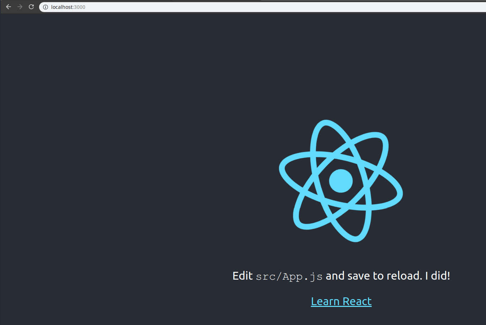

# Docker volumes

In previous section we had a running react development server, but if we changed any source, it will not reflect the changes unless the docker image is rebuilt.
We can fix this problem by using docker volumes, which basically references a folder on the local machine.

```
davis@davis-arch  ~/projects/docker/04_react_app   master  docker build -f Dockerfile.dev .
Sending build context to Docker daemon  715.8kB
Step 1/6 : FROM node:alpine
 ---> ebbf98230a82
Step 2/6 : WORKDIR /app
 ---> Using cache
 ---> 93b2648262c0
Step 3/6 : COPY package.json .
 ---> Using cache
 ---> a33dd4926364
Step 4/6 : RUN npm install
 ---> Using cache
 ---> 2f4e0c88fbee
Step 5/6 : COPY . .
 ---> Using cache
 ---> 592d9fd6172b
Step 6/6 : CMD ["npm", "run", "start"]
 ---> Running in 509374b381c9
Removing intermediate container 509374b381c9
 ---> 7aa5ed21de27
Successfully built 7aa5ed21de27
 davis@davis-arch  ~/projects/docker/04_react_app   master  docker run -p 3000:3000 -v /app/node_modules -v $(pwd):/app 542f2b7bf48a

> frontend@0.1.0 start /app
> react-scripts start

Starting the development server...

Compiled successfully!

You can now view frontend in the browser.

  Local:            http://localhost:3000/
  On Your Network:  http://172.17.0.2:3000/

Note that the development build is not optimized.
To create a production build, use npm run build.
```

Now, when making a change, you'll notice that  the changes are recompiled and reflected automatically.

```
Compiling...
Compiled successfully!
```


